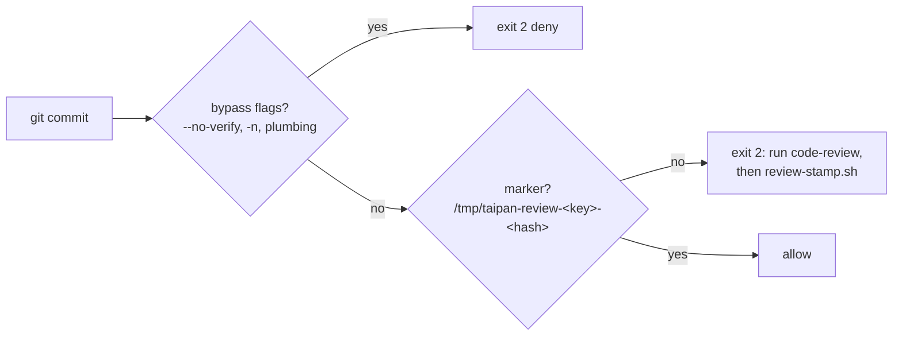

# Agent hooks

Portable hook scripts, wired per tool. Scripts are tool-agnostic:
they read the hook JSON on stdin, parse with `jq`, and exit.

## Coverage

| Tool | Manifest | Notes |
|---|---|---|
| Claude Code | `.claude/settings.json` | Native. |
| Devin CLI | `.claude/settings.json` | Compat: Devin auto-reads `.claude` hooks (`read_config_from.claude`, default on). |
| Grok | `.claude/settings.json` | Compat. Needs `/hooks-trust` once per project. |
| ZCode | `.zcode/config.json` | Native. Needs `hooks.enabled: true` (set). |

Do NOT add `.devin/hooks.v1.json` while `.claude/settings.json`
defines hooks. Devin reads both, and every hook would fire twice.

## Scripts

| Script | Event | Action |
|---|---|---|
| `pre-exec.sh` | PreToolUse (`exec`/`Bash`) | Blocks bare `python`/`pytest`/`ruff`/`alembic`/`uvicorn` (use `uv run`), `pip` (use `uv add`), `.venv` activation, force push, `git reset --hard`, `git clean -f`, dangerous `rm -rf`, `DROP TABLE`, `core.hooksPath` changes. Commit gate: blocks `git commit` without a review marker bound to the diff (see Commit gate). Then runs mode routing. |
| `pre-write.sh` | PreToolUse (write tools) | Blocks writes to `uv.lock`, `skills-lock.json`, `.venv/`, `.git/`, tool manifests (`.claude/settings*.json`, `.zcode/config*.json`, `.devin/config*.json`), gate files (`.pre-commit-config.yaml`, `scripts/check-*.sh`, the hook scripts themselves). Then runs mode routing. |
| `post-write.sh` | PostToolUse (write tools) | Em-dash check; `ruff check` on `.py`; 300-LOC warning on source files; comment-run warning (>3 consecutive comment lines after the first 10, `#`/`//`/`/*`/` *` counted, `.py`/`.ts`/`.tsx`/`.js`/`.jsx`); BFF-boundary warning on `apps/web/src` outside `app/api/`; `falsegreen`/`falsegreen-js` scan on test files + one-shot `test-smell-review` nudge. Then runs mode routing. Findings go to context. |
| `post-exec.sh` | PostToolUse (`exec`/`Bash`) | After `db-revision`: remind to review the migration. Then runs mode routing. |
| `session-start.sh` | SessionStart | Injects `.agents/memory/current.md`, the current activity mode, and the mode command; warns on broken skill symlinks. |
| `stop-nudge.sh` | Stop | Once per session per reason set: dirty tree with untouched memory, or done tickets with unchecked boxes / a missing HTML report (`taipan_done_ticket_gaps`, shared with `review-stamp.sh`). |

## Commit gate

A commit is allowed only with a review marker bound to the exact
diff it would record:



- `review-stamp.sh` runs `taipan_diff_hash`: the current HEAD plus
  every path differing from it, each with its mode and worktree blob
  hash (symlinks bind the link target), plus the cached diff of any
  path whose staged content diverges from the worktree. A content or
  mode edit after stamping invalidates the marker, and so does a
  commit/rebase/pull that moves HEAD. `git add` does not - unless
  the path was partially staged (index and worktree differed), which
  rewrites what the commit would record and needs a new stamp.
- The `code-review` skill ends with the stamp step. Review covers
  `git diff HEAD` (staged + unstaged); `test-smell-review` covers
  touched tests.
- Bypass vectors denied in `pre-exec.sh`: `--no-verify` (including
  unambiguous abbreviations), `-n` alone or bundled (`-sn`, `-avn`),
  `commit-tree`, `update-ref`, `core.hooksPath` (including
  `GIT_CONFIG_PARAMETERS`), `SKIP=`/`HUSKY=`/`LEFTHOOK=`/
  `OVERCOMMIT_DISABLE`. Read-only `git config --get`/`--list` pass.
- Flag detection is scoped to the commit invocation's own args, so a
  `-n` in a neighbouring compound command does not false-block.
  Strings inside a quoted `-m` message still can - matching is on the
  command text, not parsed argv. A command containing a second commit
  after a separator is blocked outright: one commit per command, each
  with its own marker.
- Heredoc bodies fed to `cat`/`tee` write-sinks are stripped before
  matching: prose inside `cat > f <<EOF` payloads (docs saying
  "git commit", sample SQL) does not trip the gates. The opener line
  is still checked, and sinks that execute their body
  (`bash <<EOF`, `<<EOF | sh`, `eval "$(...)"`, `$(...)`, backticks,
  process substitution `>(...)`/`<(...)`) keep the flat match.
  `<<` inside quotes, after `#`, inside `${...}`, or as part of
  `<<<` is not an opener; delimiters must be plain word chars
  (`[-._A-Za-z0-9]`), and only `<<-` tolerates an indented
  terminator. Quoted strings elsewhere are not stripped, so
  `echo 'git commit'` still blocks. Sinks narrower than bare
  `cat`/`tee` (`FOO=1 cat`, `command cat`, `cat <<EOF || true`,
  heredocs inside `if`/subshells) keep the strict flat match too:
  safe direction, at the cost of rare false blocks.
- `git -C <repo>`/`--git-dir` commits are blocked outright: the marker
  binds this repo's hash, not the foreign repo's. `cd` there and
  commit plainly. `GIT_CONFIG_KEY_n`/`GIT_CONFIG_VALUE_n` hooksPath
  pairs are denied alongside `GIT_CONFIG_PARAMETERS`.
- The marker proves a stamp file exists, not that a review ran: the
  agent can mint one itself. Same "deterrent, not boundary" model as
  the write protection below.
- Subagent calls (`agent_id` present) are exempt: `implement-spec`
  ticket commits are gated by the orchestrator's code-review step.
- Humans committing in a terminal do not pass through these hooks;
  the git-level backstops are the pre-commit checks plus the
  `commit-msg` stage (`scripts/check-commit-msg.sh`: Conventional
  Commits subject with types and scopes from
  `docs/commit-convention.md`, every message line <= 120 chars,
  `#` comments and `commit -v` scissors content ignored).
  Fresh clones get the stage via
  `default_install_hook_types`; existing checkouts need
  `pre-commit install` once.
- Branch creation (`checkout -b`, `switch -c`, `branch <name>`)
  is blocked by a pre-exec check enforcing `<type>/<slug>`
  (`scripts/check-branch-name.sh`, types from
  `scripts/conventions.sh`); the `pre-commit` and `pre-push`
  stages plus CI re-check the name. Quoted spellings evade
  the pre-exec match by design; the later gates do not.
- `git merge`/`rebase`/`cherry-pick`/`stash`/`am`/`pull` create
  commits without matching `git commit` and are not gated;
  `export SKIP=` set by an earlier command, commits inside scripts
  or Makefiles, `git ci` aliases, and quoted/IFS-obfuscated spellings
  (`git "commit"`, `git commit${IFS}-n`) are outside the string match.
  Their pre-commit hooks still run.
- Residual hole, documented: the write protection in `pre-write.sh`
  covers the write/edit tools only. A shell command (`sed -i`,
  `>`, `tee`, `python`) can still modify gate files - hooks are
  deterrents, not boundaries. The backstops are the same as for the
  commit gate: pre-commit checks, the `commit-msg` stage, and CI.

## Activity modes

The agent declares a fixed one-word label for its current phase:

```bash
bash .agents/hooks/agent-mode.sh set plan      # set
bash .agents/hooks/agent-mode.sh get           # get (prints "none" if unset)
bash .agents/hooks/agent-mode.sh clear         # clear
bash .agents/hooks/agent-mode.sh list          # vocabulary
```

Vocabulary: `plan implement test review debug docs commit`. `set`
rejects anything else. State is a file in `/tmp` keyed by project
root (an exec'd script cannot see `session_id`), so one mode serves
all sessions in this checkout - parallel sessions share it. `set`
to a different
mode and `clear` reset all markers under this project's key - route
dedup and the one-shot test-scan nudge - so a new mode re-nudges once.
Re-setting the same mode is a no-op and keeps the markers.

`route.sh` is the dispatcher. Parent hooks call it last with the raw
hook JSON on stdin and the event name as `$1`. If a mode is set and
`.agents/hooks/hooks.d/<mode>/<event>.sh` exists, it runs it.

Route contract for `hooks.d/<mode>/<event>.sh`:

- env: `TAIPAN_MODE`, `TAIPAN_TARGET` (file_path, notebook_path, or
  command), `TAIPAN_ROOT`. Prefer `TAIPAN_TARGET` over re-parsing stdin.
- stdin: the hook JSON (usually unneeded once `TAIPAN_TARGET` is read).
- stdout: a short plain-text nudge. `route.sh` hands it to the
  parent hook, which wraps it in `additionalContext`.
- Each nudge fires **once per mode-set** (dedup marker in `/tmp`),
  and only when the route actually printed something.
- Never block: exit 0 always. Hard gates live in the parent scripts,
  not in mode routes. Mode is advisory on purpose: a label the agent
  forgot to set must not silently disable enforcement.
- Skipped inside subagents (hook input carries `agent_id`).

Add a mode route: create `hooks.d/<mode>/<event>.sh` with
`<event>` in `pre-exec post-exec pre-write post-write`. No manifest
edit needed; parent hooks already call `route.sh`.

## Contract

- stdin: `{"tool_name", "tool_input": {"command"|"file_path"|"notebook_path"}, "session_id", "agent_id"?}`.
  `agent_id` is present on subagent tool calls; `route.sh` skips them.
- Block: exit `2`, reason on stderr.
- Context: stdout `{"hookSpecificOutput": {"hookEventName": "<Event>", "additionalContext": "..."}}`.
- Stop nudge uses `{"decision": "block", "reason": "..."}` so the agent continues once.
- Project root: `$DEVIN_PROJECT_DIR`, then `$CLAUDE_PROJECT_DIR`, then
  the script location (`<root>/.agents/hooks/`), then cwd.
- Fail-open: a parse error exits 0. A broken hook must not halt the agent.

## Layout

```
.agents/hooks/
  mode-lib.sh     shared helpers (sourced, not run directly)
  agent-mode.sh   mode CLI the agent calls via exec
  review-stamp.sh writes the commit-gate marker; refuses while a done
                  ticket has unchecked boxes or lacks its .html report
  route.sh        mode dispatcher, called by parent hooks
  hooks.d/        mode routes: hooks.d/<mode>/<event>.sh
    plan/pre-write.sh    warn once when editing code in plan mode
    review/pre-exec.sh   nudge code-review before commit in review mode
    test/pre-exec.sh     nudge the judgment pass before commit in test mode
```

## Test a script

```bash
echo '{"tool_name":"exec","tool_input":{"command":"pytest"},"session_id":"t"}' \
  | .agents/hooks/pre-exec.sh
echo $?   # expect 2

echo '{"tool_name":"exec","tool_input":{"command":"uv run pytest"},"session_id":"t"}' \
  | .agents/hooks/pre-exec.sh
echo $?   # expect 0
```

## See loaded hooks

- Devin CLI: `/hooks`
- Claude Code: `/hooks`
- Grok: `/hooks` (after `/hooks-trust`)
