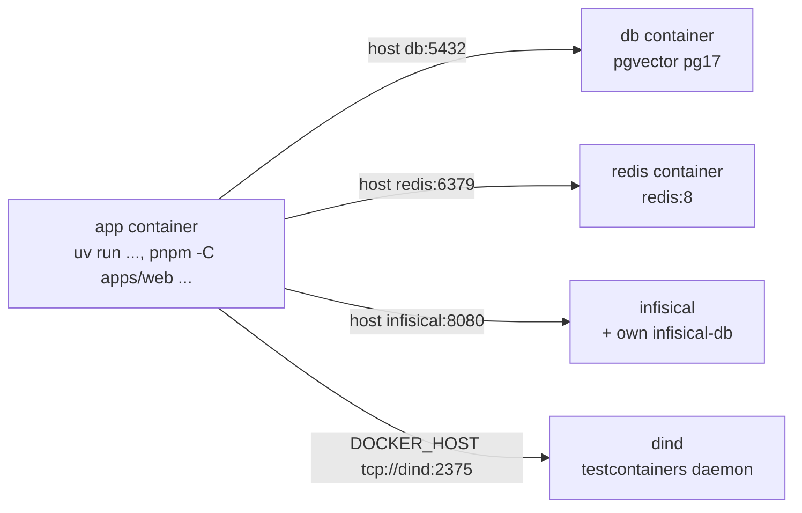

# Devcontainer

Python 3.12 + uv dev container with sibling Postgres 17 + pgvector,
Redis, and Infisical services. Node 24 + pnpm come from the node
feature for `apps/web`. Full guide: `docs/devcontainer.md`.



## Open it

- VS Code / Cursor: `Dev Containers: Reopen in Container`
- CLI: `devcontainer up --workspace-folder .`

## Inside

All README commands work unchanged:

```bash
uv run pytest            # tests hit db:5432, no skip
uv run db-upgrade        # already ran on container start
uv run api               # FastAPI on :8000, forwarded to the host
pnpm -C apps/web dev     # Next.js on :3000, forwarded to the host
```

## Env vars

Set by `docker-compose.yml`, pointing at sibling services:

| Var | Value host |
|-----|------------|
| `API_DATABASE_URL` | `db` |
| `API_TEST_ADMIN_URL` | `db` |
| `API_TEST_URL` | `db` |
| `API_REDIS_URL` | `redis` |
| `API_INFISICAL_URL` | `infisical` |
| `DOCKER_HOST` | `dind` (`tcp://dind:2375`) |

Defaults (host `localhost`) stay in the code. No `.env` file needed.
