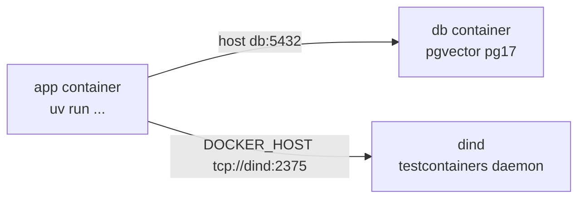

# Devcontainer

Python 3.12 + uv dev container with a sibling Postgres 17 + pgvector
service. Full guide: `docs/devcontainer.md`.



## Open it

- VS Code / Cursor: `Dev Containers: Reopen in Container`
- CLI: `devcontainer up --workspace-folder .`

## Inside

All README commands work unchanged:

```bash
uv run pytest        # tests hit db:5432, no skip
uv run db-upgrade    # already ran on container start
uv run api           # FastAPI on :8000, forwarded to the host
```

## Env vars

Set by `docker-compose.yml`, pointing at the `db` service:

| Var | Value host |
|-----|------------|
| `API_DATABASE_URL` | `db` |
| `API_TEST_ADMIN_URL` | `db` |
| `API_TEST_URL` | `db` |

Defaults (host `localhost:5432`) stay in the code. No `.env` file needed.
