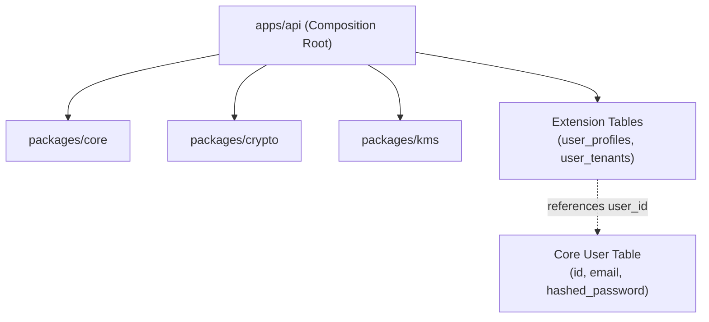
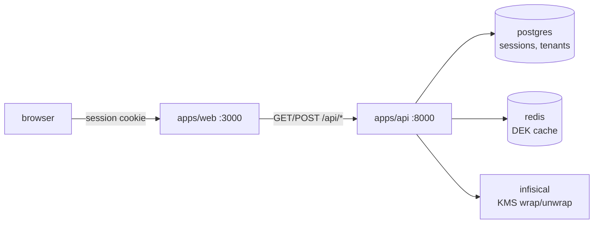

# project-taipan

A multi-tenant application stack in a Python monorepo. It pairs a
FastAPI API with a Next.js BFF frontend. Shared libraries provide
tenant-scoped, field-level encryption backed by a self-hosted
Infisical KMS.


## Prerequisites

- Python 3.12 and `uv` for the workspace.
- Docker Compose for Postgres, Redis, Infisical, and LiteLLM.
- Node.js 24 and pnpm 11.17 for `apps/web`.

## What it does today

- **Auth**: email/password register, login, logout, and
  `GET /api/auth/me`. Sessions are opaque tokens stored sha256-hashed
  in Postgres (7-day expiry, HttpOnly cookie).
- **Tenancy**: every user gets a personal tenant at register.
  Authenticated requests run inside a tenant scope resolved from the
  session (unresolved sessions run unscoped), and a flush-time guard
  rejects rows written outside that scope.
- **Field-level encryption**: per-tenant AES-256-GCM DEKs wrapped by
  Infisical KMS, a two-tier DEK cache (in-process + Redis), and a
  circuit breaker on the KMS path. The capability is wired end to end;
  no production model field is encrypted yet.
- **Web frontend**: Next.js BFF with server-rendered auth pages, a
  hardened `/api/*` proxy, and a rendered docs site at `/docs`.

## Roadmap

- OAuth sign-in
- Organization tenants (today: one personal tenant per user)
- Authorization on the `/api/users*` routes (open today)
- Event-driven communication between services
- CQRS: separate write and read models

## Layout

A Python monorepo managed with [uv workspaces](https://docs.astral.sh/uv/concepts/workspaces/).
Shared libraries live in `packages/`, runnable applications live in `apps/`.

```
├── pyproject.toml        # workspace root: members, shared dev tools
├── packages/             # puzzle pieces: domain libraries
│   ├── core/             # shared primitives and protocols
│   ├── crypto/           # envelope encryption, DEK cache, tenant scope
│   └── kms/              # Infisical KMS adapter
├── apps/                 # runnable composition roots
│   ├── cli/              # app: cli
│   ├── api/              # app: FastAPI server assembling packages
│   └── web/              # Next.js frontend, pnpm (not a uv member)
├── docs/                 # guides, ADRs, specs; rendered by apps/web /docs
└── evals/                # eval task specs
```

### Architecture: Modular Monolith (Puzzle Pieces)

The system is designed as independent puzzle pieces:

1. **Packages are standalone**: Domain logic lives in `packages/<name>/`. Packages never import from apps.
2. **Apps are composition roots**: `apps/api` wires packages together and mounts HTTP routers.
3. **Extensible entities (Pattern A)**: Core database tables (such as `users`) stay lean. They store only essential authentication fields. Applications extend entities using separate 1:1 or 1:N extension tables referencing entity IDs. This prevents schema bloat and merge conflicts. See `docs/extensible-user-entity.md`.



## API surface (apps/api)

| Route | Purpose |
|---|---|
| `POST /api/auth/register` | Create tenant + user, set session cookie; 409 on duplicate email |
| `POST /api/auth/login` | 204 + session cookie; generic 401 on failure |
| `POST /api/auth/logout` | Delete session, clear cookie; always 204 |
| `GET /api/auth/me` | `{id, email, tenant_id}` or 401 |
| `GET/POST /api/users`, `GET/DELETE /api/users/{id}` | User CRUD; no auth check yet |
| `GET/PUT /api/users/{id}/profile` | Profile read/upsert; no auth check yet |
| `GET /` | Hello-world probe; no auth |

The api also serves Swagger UI at `/docs` on `127.0.0.1:8000`. The web
app renders this repo's `docs/` markdown at `/docs` on `:3000`.

## Everyday commands

Run from the repo root - one lockfile, one virtualenv for everything:

```bash
uv sync                    # install/update everything into .venv
uv run pytest              # run all tests across all packages
uv run ruff check .        # lint everything

uv add --package core requests   # add a dep to one member
uv add pytest --dev              # add a shared dev dependency
```

Web app:

```bash
pnpm -C apps/web install   # one-time: web dependencies
pnpm -C apps/web dev       # Next.js on http://localhost:3000
pnpm -C apps/web test      # vitest unit tests
pnpm -C apps/web lint
pnpm -C apps/web exec tsc --noEmit   # typecheck (needs `next typegen` first)
```

## Run the apps

Each app registers a command in its `pyproject.toml` under `[project.scripts]`.

```bash
uv run cli                 # CLI app -> prints "Hello, world!"
docker compose up -d       # Postgres + pgvector :5432, redis :6379, Infisical :8080, LiteLLM :4000
uv run db-upgrade          # apply migrations
uv run api                 # API app -> FastAPI server on http://127.0.0.1:8000 (docs at /docs)
pnpm -C apps/web dev       # Next.js on http://localhost:3000
```

A VS Code / devcontainer setup exists too: `.devcontainer/` contains a
self-contained compose stack (app, db, redis, infisical, litellm,
dind for testcontainers). Full guide: `docs/devcontainer.md`.

## Database (api)

Postgres 17 + pgvector via docker compose. Schema changes go through Alembic:

```bash
uv run db-revision -m "add orders"   # autogen migration from model changes
uv run db-upgrade                    # apply migrations
uv run db-downgrade                  # roll back one
uv run db-current                    # show applied revision
uv run db-stamp head                 # mark a revision applied without running it
```

Always read the generated file in `apps/api/alembic/versions/` before
applying. Autogen misses renames and data migrations.

API tests run against a real `app_test` database on the docker Postgres
(recreated each run). If Postgres is not up, they skip.

Env vars are registered in `apps/api/.env.example`. Copy to `.env` and run
with `uv run --env-file apps/api/.env api`.

## Secrets (Infisical)

Self-hosted Infisical runs in the dev compose stack on :8080 (UI + API).
It gets its own Postgres (`infisical-db` service, no host port) -
same shape as the cloud deploy where it is a separate instance, not
a database inside the app postgres.

First run of a new instance needs an admin, org, and machine identity:

```bash
bash scripts/infisical-bootstrap.sh   # prints the MI token
```

Then provision the platform KMS key. Set `INFISICAL_ADMIN_TOKEN` to
the admin identity token from the bootstrap step, then:

```bash
uv run python scripts/provision_kms.py   # finds or creates the key, prints only its id
```

The script is safe to rerun. `--verify` proves the runtime token can
decrypt. Env vars, verify, and the identity grant: `docs/infisical.md`.

`docker-compose.yaml` provides development defaults for
`INFISICAL_ENCRYPTION_KEY` and `INFISICAL_AUTH_SECRET`. Set both through
your production deployment environment. Keep a backup of
`INFISICAL_ENCRYPTION_KEY`; stored secrets cannot be decrypted if
it is lost.

The full operator checklist (KMS project, key, machine identities,
Railway gotchas) lives in `docs/infisical.md`.

## Frontend (web)

`apps/web` is Next.js acting as the BFF: pages are server-rendered and
a route handler proxies `/api/*` to FastAPI, forwarding the session
cookie. The browser never talks to FastAPI directly.



- `API_INTERNAL_URL` (server-only) points the proxy at FastAPI.
  Required in production; defaults to `http://localhost:8000` in dev.
- `PUBLIC_ORIGIN` is the browser-facing origin used to rewrite upstream
  redirects. Required in production.
- `DOCS_DIR` overrides where the docs site reads markdown (default:
  repo `docs/`).
- Vars are registered in `apps/web/.env.example`; copy to `.env.local`
  for local overrides.
- `apps/web/Dockerfile` builds a standalone production image.
  Build context is the repo root, same as `apps/api/Dockerfile`:
  `scripts/docker-build.sh web` or `scripts/docker-build.sh api`.

## Docs

- `docs/devcontainer.md` - devcontainer topology and troubleshooting.
- `docs/infisical.md` - Infisical/KMS operator guide.
- `docs/extensible-user-entity.md` - Pattern A extension-table recipe.
- `docs/adr/` - architecture decision records.
- `docs/specs/` - feature specs, split into `planned/` and `implemented/`.

`apps/web` renders these files at `/docs` when it runs.

## Adding a new project

1. Create `packages/<name>/` (library) or `apps/<name>/` (application) with a
   `pyproject.toml` and `src/<import_name>/__init__.py` - copy an existing one.
2. Add it to the root `pyproject.toml` dependencies + `[tool.uv.sources]`
   (`<name> = { workspace = true }`).
3. To depend on another workspace member, do the same in your project's
   `pyproject.toml`.
4. `uv sync`.

## Conventions

- `src/` layout per package (import from `packages/core/src/core`).
- Tests live under `tests/` inside each member that has them.
- Python version pinned in `.python-version`; lockfile is `uv.lock`.
- Hard gates (`scripts/`): `check-file-size.sh` caps source files at
  300 lines; `check-bff.sh` enforces the web BFF boundary;
  `check-docker.sh` requires Dockerfile COPY sources to resolve at repo
  root; `check-unreached-components.sh` fails on unreached web
  components. All four run in pre-commit and CI. A fifth,
  `check-commit-msg.sh`, caps commit message lines at 120 chars and
  runs at the commit-msg stage.
- `pre-commit` runs ruff, an em-dash fixer, and the gate scripts on
  commit; pytest and web lint/typecheck on push.
  Install hooks with `uv run pre-commit install` (commit hook) and
  `uv run pre-commit install --hook-type pre-push` (pytest on push).
  Also run `uv tool install pre-commit` once per machine so the hook's
  PATH fallback works; without it the hook breaks when `.venv` moves.
  `.git/hooks` is bind-mounted into the devcontainer, so host and
  container share the installed hooks: the last `pre-commit install`
  wins. Reinstall on whichever side you commit from.
- Agent hooks enforce the repo rules inside Claude Code, Devin, Grok,
  and ZCode. Scripts live in `.agents/hooks/` - see its README for the
  coverage table and how to test them.
