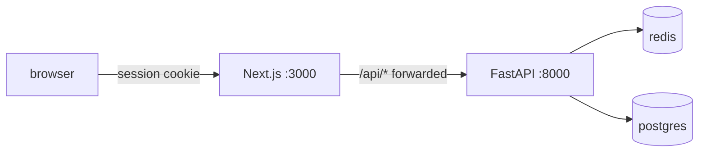

# apps/web rules

Applies inside `apps/web/` in addition to the root `AGENTS.md`.

## Stack

- Next.js (App Router) + React + Tailwind, TypeScript strict.
- Package manager is `pnpm`. Never use npm or yarn here.
- Not a uv workspace member. Run `pnpm -C apps/web <cmd>` from root.

## Architecture (BFF)



- The browser never calls FastAPI directly. The catch-all route
  handler at `src/app/api/[...path]/route.ts` forwards `/api/*` to
  `API_INTERNAL_URL` and re-emits `Set-Cookie`. Do not bypass it.
- FastAPI owns sessions and Redis. The web side only forwards cookies.
- `API_INTERNAL_URL` is server-only. Never expose it via
  `NEXT_PUBLIC_` and never reference it outside `src/app/api/`.
- Env vars are documented in `.env.example`. Local overrides go in
  `.env.local` (gitignored).

## Gates (enforced, do not weaken)

- `scripts/check-bff.sh` - boundary rules above as a script.
  pre-commit + CI.
- `scripts/check-file-size.sh` - 300 LOC cap per source file,
  pre-commit + CI.
- `tsconfig.json` - `strict` plus `noUncheckedIndexedAccess`,
  `noImplicitReturns`, `noFallthroughCasesInSwitch`,
  `verbatimModuleSyntax`.
- eslint - `no-explicit-any`, `consistent-type-imports`, `eqeqeq`
  are errors.
- `tsc --noEmit` needs generated types first: run
  `pnpm exec next typegen` after a clean checkout or `rm -rf .next`
  (LayoutProps/PageProps live in `.next/types`).
- pre-push runs `pnpm lint` + `next typegen` + `tsc --noEmit`.

## Files

- `Dockerfile` - standalone production image (`next build` with
  `output: "standalone"`). Build context is the repo root:
  `scripts/docker-build.sh web` (root context; the script is canonical)
- `src/proxy.ts` - reserved for the Next 16 auth gate once auth
  endpoints exist (replaces the old `middleware.ts` convention).

## Commands

```bash
pnpm -C apps/web install
pnpm -C apps/web dev       # dev server on :3000, proxies to :8000
pnpm -C apps/web build     # production build (standalone output)
pnpm -C apps/web lint
pnpm -C apps/web exec tsc --noEmit
```
