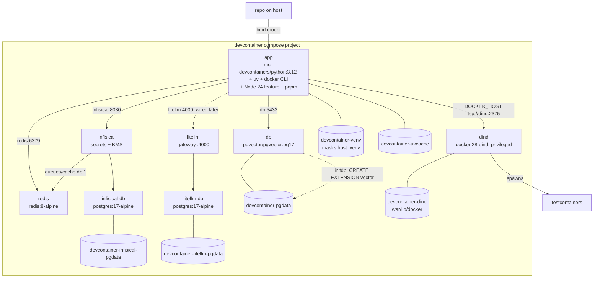
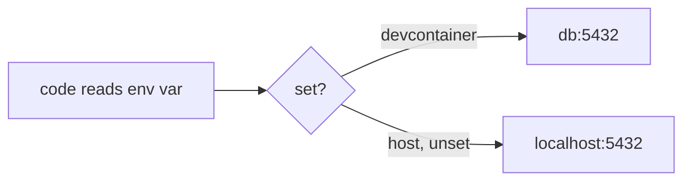
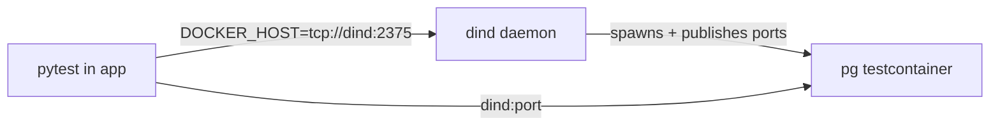
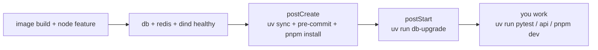

# Devcontainer guide

The devcontainer gives a full dev environment: Python 3.12, uv, git,
pre-commit hooks, Node 24 + pnpm, Postgres 17 + pgvector, Redis,
Infisical, LiteLLM, and a Docker-in-Docker daemon for testcontainers.
Everything the README commands need is inside.

## Layout



Files:

- `.devcontainer/Dockerfile` - dev image. `devcontainers/python:3.12`
  gives git, ssh, zsh, and the `vscode` user. uv is copied in, pinned.
- `.devcontainer/docker-compose.yml` - `app`, `db`, `redis`,
  `infisical`, `infisical-db`, `litellm`, `litellm-db`, and `dind`
  services.
- `.devcontainer/devcontainer.json` - service, lifecycle hooks, ports,
  editor extensions. Node 24 comes from the `devcontainers/features/node`
  feature; `corepack` in `postCreate` enables pnpm.
- `.devcontainer/README.md` - quick reference.

## Why its own compose file

The root `docker-compose.yaml` db publishes `5432:5432` on the host.
Inside a devcontainer that publish is useless (the dev container reaches
db over the compose network) and can collide with anything else on the
host port. So the devcontainer stack is self-contained and publishes
nothing. Cost: the `db`, `infisical` + `infisical-db`, and
`litellm` + `litellm-db` service blocks are duplicated. Keep their
images and env in sync with `docker-compose.yaml` when they
change.

## How the app finds the db

On the host, code defaults to `localhost:5432`. In the devcontainer the
db is a sibling service named `db`. The compose file sets env vars, so
no code changes are needed per environment:



- `api.db` reads `API_DATABASE_URL` (always did).
- `conftest.py` reads `API_TEST_ADMIN_URL` and `API_TEST_URL`. It needs
  an admin URL too because tests create the `app_test` database.
- `API_REDIS_URL` (DEK cache for field encryption; sessions live in
  Postgres) points at the `redis` service. It defaults to
  `localhost:6379` on the host.
- `API_INFISICAL_URL` points at the `infisical` service
  (`http://infisical:8080`). It defaults to `localhost:8080` on the
  host. The Infisical UI is not port-forwarded; the api reaches it over
  the compose network.
- The api vars are registered in `apps/api/.env.example`, the web
  vars in `apps/web/.env.example`.

## Docker for testcontainers

Integration tests use testcontainers, which needs a Docker daemon. The
`dind` service is that daemon:



Why DinD and not the host socket (DooD):

- Host socket mounts leak test containers onto the host daemon. They
  also need rootless-socket paths on Linux (`/run/user/$UID/...`) and a
  privileged ryuk flag. DinD is identical on every host.
- `dind` is privileged and only reachable on the private compose
  network. TLS is off (`DOCKER_TLS_CERTDIR=""`) for the same reason.
- `devcontainer-dind` volume caches pulled test images across rebuilds.
- `docker` CLI is in the app image for debugging: `docker ps` inside the
  devcontainer lists what testcontainers spawned.

## Lifecycle



- `postCreateCommand` runs once per container create: installs deps and
  both git hooks (commit and pre-push).
- `postStartCommand` runs `db-upgrade` on every start. It is idempotent
  and keeps the dev db at head.

## The .venv mask

The repo is bind-mounted into the container. A host-built `.venv` sits
inside it. Its interpreter symlinks and script shebangs point at host
absolute paths, so it is broken in the container. The
`devcontainer-venv` named volume mounts over
`/workspaces/project-taipan/.venv`, giving the container its own venv
that persists across rebuilds. `uv sync` in `postCreateCommand` fills
it.

Same trick for `~/.cache/uv`: `devcontainer-uvcache` keeps the uv
package cache across rebuilds.

## Daily use

```bash
uv sync                  # after pulling lockfile changes
uv run pytest            # full suite, db-backed tests included
uv run ruff check .
uv run api               # http://localhost:8000 (auto-forwarded)
pnpm -C apps/web dev     # http://localhost:3000 (auto-forwarded)
uv run db-revision -m "add orders"
git commit / git push    # hooks run inside the container
```

## Rebuild

After editing `.devcontainer/Dockerfile` or `docker-compose.yml`:

- VS Code: `Dev Containers: Rebuild Container`
- Keeps all six volumes: `devcontainer-venv`, `devcontainer-pgdata`,
  `devcontainer-uvcache`, `devcontainer-dind`,
  `devcontainer-infisical-pgdata`, `devcontainer-litellm-pgdata`.

Full reset (drops the dev db data):

```bash
devcontainer up --workspace-folder . --remove-existing-container
docker volume rm project-taipan_devcontainer_devcontainer-pgdata
```

The volume prefix follows the compose project name. Under the
devcontainer CLI it is `project-taipan_devcontainer`; under a manual
`docker compose -f .devcontainer/docker-compose.yml` run it is
`devcontainer_`.

## Troubleshooting

**Tests skip with "postgres not running".**
The `db` service is down or the env vars are unset. The devcontainer
CLI runs the stack under project `project-taipan_devcontainer`:
`docker compose -p project-taipan_devcontainer -f .devcontainer/docker-compose.yml ps`.
If you opened the folder without the devcontainer, use the host flow:
`docker compose up -d` (root file) + localhost defaults.

**`uv sync` recreates `.venv` on every container start.**
The `devcontainer-venv` volume is not mounted over
`/workspaces/project-taipan/.venv`. Check the volume lines in
`docker-compose.yml`.

**Port 8000 or 3000 not reachable on the host.**
Only ports in `forwardPorts` are forwarded. Both are listed; if you run
something else (e.g. 5432 for a host-side DB client), add it or publish
`ports: ["5433:5432"]` on the db service in a local override.

**Pre-commit hook fails on git commit.**
`postCreateCommand` may not have run. Run
`uv run pre-commit install && uv run pre-commit install --hook-type pre-push`.
Note: `.git/hooks` is bind-mounted, so host and container share the
installed hooks. The hook bakes in an absolute `.venv` path, so the
last side to run `pre-commit install` wins. If you commit on the host
after the devcontainer ran postCreate, reinstall the hooks on the host
(and vice versa).

**testcontainers cannot reach Docker.**
`DOCKER_HOST` must be `tcp://dind:2375` and `dind` must be healthy:
`docker compose -f .devcontainer/docker-compose.yml ps`. First test run
pulls the test image inside dind - slow once, cached after.

**Stale db schema after pulling new migrations.**
`postStartCommand` should cover this. Run `uv run db-upgrade` manually
if needed.

**Why the container runs as root.**
This host uses rootless Docker: the host uid maps to container uid 0,
so the bind-mounted repo looks `root:root` inside. A non-root user
cannot write it. `user: root` is required on rootless hosts. On a
rootful Linux host or Docker Desktop you may switch `user` and
`remoteUser` to `vscode` and the cache volume back to
`/home/vscode/.cache/uv`.
