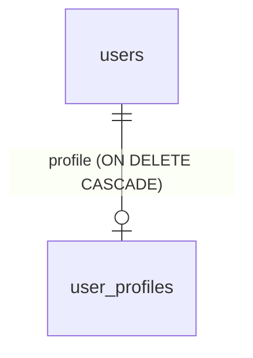

# Extensible user entity: extension tables (Pattern A)

This page teaches how to attach custom data to `User` without
editing the `users` table. It is the downstream guide for the
[extensible user entity spec](specs/implemented/extensible-user-entity/spec.md).
The worked example is the landed `user_profiles` table.

## The rule

Core entities hold identity and credential fields only. `User`
keeps `id`, `email`, `hashed_password`, `is_active`, `created_at`,
and `updated_at`. Nothing else. Domain data lives in separate
extension tables. Each extension table references `users.id` with
a foreign key. The decision record for this rule lives at
`.agents/memory/decisions/extensible-entities-pattern-a.md`.

## Why direct columns fail

Adding domain columns straight to `users` causes three problems:

1. It pollutes the core authentication model with domain-specific
   fields.
2. It causes schema merge conflicts when upstream updates the
   table.
3. It couples unrelated features to the authentication lifecycle.

An extension table avoids all three. The feature owns its own
table, migration, and model file. Upstream `users` changes stay
small and conflict-free.

## The recipe

Four steps. The reference code is `apps/api/src/api/models/profile.py`
and `apps/api/alembic/versions/7100c73337f1_create_user_profiles_table.py`.

### 1. Write the extension model

Create a new module in `apps/api/src/api/models/`. Give the model
its own `id` primary key and a `user_id` foreign key. Add a
relationship back to `User`. Use `TYPE_CHECKING` for the `User`
import to avoid a circular import.

```python
from datetime import datetime
from typing import TYPE_CHECKING

from sqlalchemy import (
    CheckConstraint,
    DateTime,
    ForeignKey,
    func,
)
from sqlalchemy.orm import Mapped, mapped_column, relationship

from api.db import Base

if TYPE_CHECKING:
    from api.models.user import User


class UserProfile(Base):
    """Pattern A extension table: profile data lives here, never on users."""

    __tablename__ = "user_profiles"
    __table_args__ = (
        # The API caps these fields too; the CHECKs bound what bypasses it.
        CheckConstraint("LENGTH(display_name) <= 100", name="ck_user_profiles_display_name_len"),
        CheckConstraint("LENGTH(avatar_url) <= 2048", name="ck_user_profiles_avatar_url_len"),
        CheckConstraint("LENGTH(bio) <= 5000", name="ck_user_profiles_bio_len"),
    )

    id: Mapped[int] = mapped_column(primary_key=True)
    user_id: Mapped[int] = mapped_column(
        ForeignKey("users.id", ondelete="CASCADE"),
        unique=True,
        index=True,
    )
    display_name: Mapped[str | None]
    avatar_url: Mapped[str | None]
    bio: Mapped[str | None]
    created_at: Mapped[datetime] = mapped_column(DateTime(timezone=True), server_default=func.now())
    updated_at: Mapped[datetime] = mapped_column(
        DateTime(timezone=True), server_default=func.now(), onupdate=func.now()
    )

    user: Mapped["User"] = relationship(back_populates="profile")
```

### 2. Shape the foreign key: 1:1 with a database cascade

Three settings on `user_id` give the 1:1 shape and the cleanup
rule:

- `ForeignKey("users.id", ondelete="CASCADE")`: the database
  deletes the extension row when the user row goes.
- `unique=True`: at most one extension row per user.
- `index=True`: lookups by `user_id` stay fast.

Then mirror the shape on the `User` side. `uselist=False` makes the
relationship 1:1 in the ORM. The ORM cascade mirrors the database
cascade for session deletes.

```python
profile: Mapped["UserProfile | None"] = relationship(
    "UserProfile", back_populates="user", uselist=False, cascade="all, delete-orphan"
)
```

For a 1:N extension (many rows per user), drop `unique=True` and
`uselist=False`. Keep `ondelete="CASCADE"` either way.

### 3. Add the Alembic migration

```bash
uv run db-revision -m "add user_profiles"
uv run db-upgrade
```

Always read the generated file in `apps/api/alembic/versions/`
before you apply it. Autogen misses renames and data migrations.
The migration must match the model exactly: the
`ondelete="CASCADE"` inside the `ForeignKeyConstraint`, the unique
index on `user_id`, the three CHECK length limits, and
`DateTime(timezone=True)` on the timestamps. See
`7100c73337f1_create_user_profiles_table.py` for the reference.

### 4. Register the model

Add one import line in `apps/api/src/api/models/__init__.py`:

```python
from api.models.profile import UserProfile
```

This step is not optional. `Base.metadata` only sees tables whose
module was imported. Without the import, `create_all` silently
skips the table and Alembic autogen sees nothing.

## The data shape



One user row has zero or one profile row. Deleting the user row
deletes the profile row in the database. No application code runs
for that cleanup.

## When not to use

Pattern A is not the tool for these cases (from the spec's
out-of-scope list):

- Polymorphic inheritance or single-table inheritance.
- Changes to authentication tokens, session cookies, or passwords.
- Moving `User` to a separate package. Later packaging specs
  handle that.

Tenant scope landed after this page was written. `user_tenants` is a
second Pattern A extension table in-tree: it carries `tenant_id`, and
the request tenant scope plus the flush-time guard
(`apps/api/src/api/tenant_guard.py`) apply to it. Extension tables
that store tenant-owned data should carry `tenant_id` the same way.
