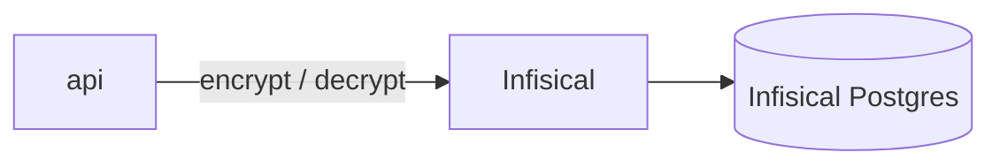
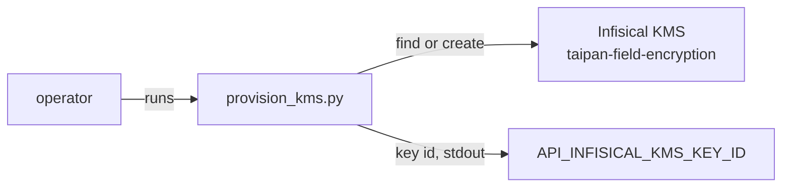
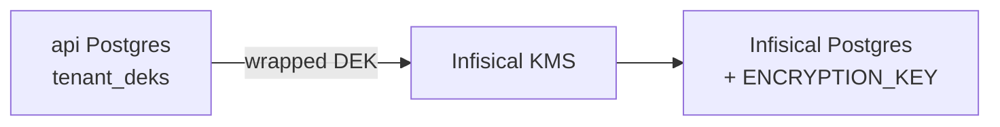

# Infisical operator guide

The project runs a self-hosted Infisical instance. It stores secrets
and hosts the KMS keys the api uses for encryption. This guide takes
you from an empty instance to a working api-to-Infisical chain.

## How the pieces fit



Infisical keeps its state and its key material in its own Postgres
instance (`infisical-db` in compose). The api never touches that
database. It only calls the Infisical HTTP API.

## Two identities

Two machine identities exist, with different powers. Do not mix them.

**Bootstrap / admin identity.** `scripts/infisical-bootstrap.sh`
creates this one. It can create projects, create keys, and rotate
keys. Integration tests use it to self-provision a throwaway KMS
project. Ops use it for rotation. The provisioning script below uses
it too. In dev, its token goes into `API_INFISICAL_TOKEN` so the
tests can run.

**`taipan-api` machine identity.** Created in the UI with Token Auth
and the `cryptographic-operator` role. It can only encrypt and
decrypt. At runtime, `API_INFISICAL_TOKEN` holds this token. It never
creates or rotates anything. Rotation is an ops action, not an api
credential right.

## Local bring-up

1. Start the compose stack:

   ```bash
   docker compose up -d
   ```

   Infisical comes up on `:8080` (UI and API). It uses the
   `infisical-db` Postgres and the shared `redis` service.

2. Bootstrap the instance:

   ```bash
   bash scripts/infisical-bootstrap.sh
   ```

   The script creates the admin user, the `taipan` org, and an admin
   machine identity. It prints the identity token. Store it as
   `API_INFISICAL_TOKEN` in dev. The script is idempotent. It exits
   clean when the instance is already bootstrapped.

   The script reads env overrides: `INFISICAL_URL`,
   `INFISICAL_ADMIN_EMAIL`, `INFISICAL_ADMIN_PASSWORD`,
   `INFISICAL_ADMIN_ORG`, `INFISICAL_WAIT_RETRIES`. See the script
   header for the defaults.

### UI setup alternative

You can bootstrap by hand instead of running the script:

1. Open `http://localhost:8080`. In the devcontainer the `infisical`
   service publishes no host port, so this only works on the host
   compose stack. For devcontainer work, use the bootstrap script
   against `http://infisical:8080` (set `INFISICAL_URL` accordingly).
2. Sign up on first boot. This account is the admin.
3. Create the `taipan` organization.
4. Create a machine identity. Use Token Auth. Give it the admin role
   the tests need.
5. Copy the identity token into `API_INFISICAL_TOKEN`.

## KMS project and key

One platform KMS key serves every tenant. The script
`scripts/provision_kms.py` creates it. It finds or creates the pinned
project `taipan-field-encryption` and the pinned key
`platform-field-encryption`. It is safe to run twice.

```bash
uv run python scripts/provision_kms.py
```

Run it from the repo root. It reads two env vars, plus a third when
`--verify` runs:

| Var | What it holds |
| --- | --- |
| `INFISICAL_ADMIN_TOKEN` | Token of the admin machine identity. Script-only: no runtime code reads it. The script fails loud when it is missing. |
| `API_INFISICAL_URL` | Base URL of the Infisical instance. Same var and default as the api config (`http://localhost:8080`). |
| `API_INFISICAL_TOKEN` | Runtime machine identity token. Only read for `--verify`; see the next section. |

The script prints the key id on stdout. One line, nothing else.
Human text goes to stderr. Nothing is written to files. The key comes
with the right defaults: AES-256-GCM, encrypt-decrypt usage, no
export, delete protection on. Copy the key id into
`API_INFISICAL_KMS_KEY_ID`.



### Verify the runtime token

Pass `--verify` to prove the runtime token can use the key:

```bash
uv run python scripts/provision_kms.py --verify
```

The flag roundtrips one payload. It encrypts and decrypts with the
token in `API_INFISICAL_TOKEN` against the key id. On failure the
script exits nonzero and prints a hint that names the cause. A 401 or
403 means the grant hint: add the identity to the project membership.
Anything else means the backend hint: check `API_INFISICAL_URL` and
backend health. The script also prints a found or created line per
object; a created line where you expected found signals a duplicate
or a blind token.

One dev caveat. In dev, `API_INFISICAL_TOKEN` often holds the admin
token. Verify then proves little: the admin can always use the key.
The real target is the dedicated `taipan-api` machine identity token
used by deployed envs.

### Grant the identity (manual step)

Membership is not automated. A fresh identity sits outside the
project: the membership default is `no-access`. Grant it by hand when
`--verify` fails:

1. Open the project `taipan-field-encryption` in the UI.
2. Add the identity whose token is in `API_INFISICAL_TOKEN`. For
   deployed envs this is the `taipan-api` identity.
3. Set the role to the built-in `cryptographic-operator`. It is
   project-scoped and covers every key in the project.

Scripted alternative: `POST
/api/v1/projects/{projectId}/memberships/identities/{identityId}`.
Set the role explicitly. A grant without an explicit role leaves the
identity with `no-access`.

## Paired restore: api Postgres and Infisical

The api stores one wrapped DEK per tenant in its own Postgres
(`tenant_deks` table). The wrapped DEK only unwraps through the
Infisical KMS key that wrapped it. Restores are therefore paired.



**Never delete or disable a KMS key that wrapped a DEK.** Rotation is
a version change, so old versions keep unwrapping old wrapped DEKs.
A deleted key makes every row it wrapped unreadable. A backup of the
api Postgres is only readable against a restored Infisical: its
database plus its `ENCRYPTION_KEY`.

## Env vars

### Api side

The api reads three Infisical vars. They are registered in
`apps/api/.env.example`.

| Var | What it holds | Default |
| --- | --- | --- |
| `API_INFISICAL_URL` | Base URL of the Infisical instance. | `http://localhost:8080` |
| `API_INFISICAL_TOKEN` | Machine identity token. At runtime this is the `taipan-api` token. In dev it may hold the admin token from the bootstrap script, so tests can self-provision. | Empty until bootstrap |
| `API_INFISICAL_KMS_KEY_ID` | Id of the KMS key the api uses. | Empty until `scripts/provision_kms.py` prints it |

Four more vars tune the crypto path around that KMS call. All are
optional and live in `apps/api/.env.example`.

| Var | What it holds | Default |
| --- | --- | --- |
| `API_DEK_CACHE_TTL` | Seconds an unwrapped DEK lives in the Redis (L2) cache. | `900` |
| `API_DEK_CACHE_L1_TTL` | Seconds an unwrapped DEK lives in the process-local (L1) cache before falling back to Redis. | `60` |
| `API_KMS_BREAKER_THRESHOLD` | Consecutive KMS failures before the circuit breaker opens. | `3` |
| `API_KMS_BREAKER_COOLDOWN` | Seconds an open breaker waits before a half-open probe. | `30` |

With `API_INFISICAL_TOKEN` or `API_INFISICAL_KMS_KEY_ID` empty, the
encryption capability stays off: the api boots without a field crypto
module and `EncryptedString` columns are not usable.

### Infisical service side

These vars configure the Infisical service itself, not the api. The
compose file sets dev defaults. Production sets them as deployment
variables (Railway).

| Var | Note |
| --- | --- |
| `AUTH_SECRET` | Session signing secret. |
| `ENCRYPTION_KEY` | Root secret for stored secrets. Back it up. |
| `DB_CONNECTION_URI` | Postgres connection for Infisical state. |
| `REDIS_URL` | Redis for queues and cache. |
| `SITE_URL` | Public URL of the instance. Must include the scheme. |

## Railway gotchas

**`SITE_URL` needs the full `https://` URL.** A bare domain crashes
WebAuthn init at boot with `TypeError: Invalid URL`. The server never
binds its port. Railway reports SUCCESS but serves 502.

**Keep Postgres in the same region.** A fresh instance runs ~770
migrations. Cross-region this crawled for 20+ minutes. Same-region
finished in about 90 seconds. Check the region before you assume the
deploy is stuck.

**Back up `ENCRYPTION_KEY`.** Losing it makes every stored secret
unreadable. Save it somewhere safe outside Railway.

**KMS keys are non-exportable by design.** The backup story is a
Postgres dump of the Infisical database plus the `ENCRYPTION_KEY`
variable. Plan for both.
