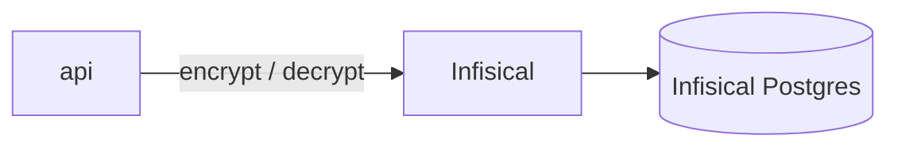

# Infisical operator guide

The project runs a self-hosted Infisical instance. It stores secrets
and hosts the KMS keys the api uses for encryption. This guide takes
you from an empty instance to a working api-to-Infisical chain.

## How the pieces fit



Infisical keeps its state and its key material in its own Postgres
instance (`infisical-db` in compose). The api never touches that
database. It only calls the Infisical HTTP API.

## Two identities

Two machine identities exist, with different powers. Do not mix them.

**Bootstrap / admin identity.** `scripts/infisical-bootstrap.sh`
creates this one. It can create projects, create keys, and rotate
keys. Integration tests use it to self-provision a throwaway KMS
project. Ops use it for rotation. In dev, its token goes into
`API_INFISICAL_TOKEN` so the tests can run.

**`taipan-api` machine identity.** Created in the UI with Token Auth
and the `cryptographic-operator` role. It can only encrypt and
decrypt. At runtime, `API_INFISICAL_TOKEN` holds this token. It never
creates or rotates anything. Rotation is an ops action, not an api
credential right.

## Local bring-up

1. Start the compose stack:

   ```bash
   docker compose up -d
   ```

   Infisical comes up on `:8080` (UI and API). It uses the
   `infisical-db` Postgres and the shared `redis` service.

2. Bootstrap the instance:

   ```bash
   bash scripts/infisical-bootstrap.sh
   ```

   The script creates the admin user, the `taipan` org, and an admin
   machine identity. It prints the identity token. Store it as
   `API_INFISICAL_TOKEN` in dev. The script is idempotent. It exits
   clean when the instance is already bootstrapped.

   The script reads env overrides: `INFISICAL_URL`,
   `INFISICAL_ADMIN_EMAIL`, `INFISICAL_ADMIN_PASSWORD`,
   `INFISICAL_ADMIN_ORG`, `INFISICAL_WAIT_RETRIES`. See the script
   header for the defaults.

### UI setup alternative

You can bootstrap by hand instead of running the script:

1. Open `http://localhost:8080`.
2. Sign up on first boot. This account is the admin.
3. Create the `taipan` organization.
4. Create a machine identity. Use Token Auth. Give it the admin role
   the tests need.
5. Copy the identity token into `API_INFISICAL_TOKEN`.

## KMS project and key

The api encrypts and decrypts through a KMS project.

1. Create a project of type KMS.
2. Inside it, create a key.
3. Set the algorithm to AES-256-GCM and the usage to
   encrypt-decrypt.
4. Leave key export off. Keys are non-exportable by design.
5. Copy the key id. It goes into `API_INFISICAL_KMS_KEY_ID`.

## Env vars

### Api side

The api reads exactly three Infisical vars. They are registered in
`apps/api/.env.example`.

| Var | What it holds | Default |
| --- | --- | --- |
| `API_INFISICAL_URL` | Base URL of the Infisical instance. | `http://localhost:8080` |
| `API_INFISICAL_TOKEN` | Machine identity token. At runtime this is the `taipan-api` token. In dev it may hold the admin token from the bootstrap script, so tests can self-provision. | Empty until bootstrap |
| `API_INFISICAL_KMS_KEY_ID` | Id of the KMS key the api uses. | Empty until you create a key |

### Infisical service side

These vars configure the Infisical service itself, not the api. The
compose file sets dev defaults. Production sets them as deployment
variables (Railway).

| Var | Note |
| --- | --- |
| `AUTH_SECRET` | Session signing secret. |
| `ENCRYPTION_KEY` | Root secret for stored secrets. Back it up. |
| `DB_CONNECTION_URI` | Postgres connection for Infisical state. |
| `REDIS_URL` | Redis for queues and cache. |
| `SITE_URL` | Public URL of the instance. Must include the scheme. |

## Railway gotchas

**`SITE_URL` needs the full `https://` URL.** A bare domain crashes
WebAuthn init at boot with `TypeError: Invalid URL`. The server never
binds its port. Railway reports SUCCESS but serves 502.

**Keep Postgres in the same region.** A fresh instance runs ~770
migrations. Cross-region this crawled for 20+ minutes. Same-region
finished in about 90 seconds. Check the region before you assume the
deploy is stuck.

**Back up `ENCRYPTION_KEY`.** Losing it makes every stored secret
unreadable. Save it somewhere safe outside Railway.

**KMS keys are non-exportable by design.** The backup story is a
Postgres dump of the Infisical database plus the `ENCRYPTION_KEY`
variable. Plan for both.
