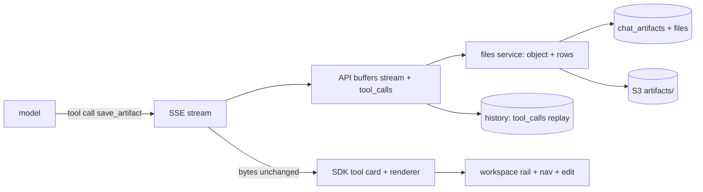

# Chat artifacts

Status: implemented.

## Problem Statement

Assistant answers live only inside message bubbles. A report, table, or
document the assistant produces cannot be opened on its own, listed,
edited, or revisited once the thread scrolls on. The OpenUI SDK has a
full artifact system (workspace rail, artifact browser, side panel)
that taipan does not use.

## Solution

The assistant gains a `save_artifact` tool. When it calls the tool, the
API persists the content as a versioned, tenant- and user-scoped
artifact row whose bytes live in the files registry. The web registers
an artifact renderer and storage, so the SDK shows the workspace rail,
the sidebar artifact nav, and the side panel; documents and tables edit
in place through the workspace. Tool calls persist in history, so the
in-thread card replays after a reload. Artifacts survive thread
deletion and are deletable from the UI.

## User Stories

1. As an authenticated member, I want the assistant to save a long answer as
   a document, so that I can open it later on its own.
2. As an authenticated member, I want an artifact list in the sidebar, so
   that I can find past deliverables.
3. As an authenticated member, I want the workspace rail to open a saved
   artifact next to the chat, so that I keep the conversation context.
4. As an authenticated member, I want to edit and delete artifacts in
   the workspace, so that deliverables stay usable.
5. As an authenticated member, I want my artifacts to survive thread
   deletion, so that deliverables outlive the conversation that made
   them.
6. As an authenticated member, I want artifacts scoped to me, so that other
   users never see mine.
7. As an operator, I want artifacts versioned on update, so that history of
   changes is traceable.

## Implementation Decisions

### Creation path: a save tool

The SDK registers artifacts only from tool calls, and taipan's gateway is a
plain OpenAI-compatible relay. So:

- The completion request gains `tools: [save_artifact]` with
  `tool_choice: "auto"`. The tool schema: `{title, type, content}` where
  `type` is `taipan_document` (markdown string) or `taipan_table` (JSON
  rows).
- Tools attach only when the resolved model supports them: the model
  catalog exposes `supports_function_calling` and `supports_tool_choice`
  from `/model/info` (verified on the dev gateway). Without
  `function_calling` the request sends no `tools` at all; without
  `tool_choice` `tools` go but `tool_choice` is omitted.
- `Gateway.stream` gains an optional `tools` parameter alongside messages.
- `complete.py` already buffers the whole stream. It now also accumulates
  `delta.tool_calls` fragments, upserts one artifact row per call at stream
  close, and relays the SSE bytes unchanged so the SDK renders its own tool
  timeline card.
- The API never fabricates a tool result message, so the live-thread parser
  sees `args` only. The renderer parser builds everything from `args`
  (partial JSON mid-stream; the SDK ships `partialJSONParse` for this).
- History stores the tool call: `_persist` appends the assistant message
  with its `tool_calls` array (arguments as streamed strings), so the
  in-thread tool card replays after a reload from the same data the
  renderer parsed live.
- A model that never calls the tool changes nothing today; the parameter is
  inert overhead.

### Storage

One migration adds `chat_artifacts` (extension table):

- `id` UUID pk, `user_id` FK users cascade, `tenant_id` text, `thread_id`
  UUID FK chat threads `ON DELETE SET NULL` nullable, `type` text, `title`
  text, `file_id` UUID FK files restrict, `version` int, created and
  updated timestamps.
- Index: `(user_id, type, updated_at)` for keyset listing. The `name`
  filter is an ilike substring match; artifact counts per user stay small
  enough that no dedicated search index is warranted.
- Update bumps `version`. Delete is exposed in the workspace UI and the API.

Artifact bytes never sit in Postgres. Each row points at a `files`
registry row from the object-storage spec (purpose `artifact`, scope
`user`, key prefix `artifacts/{tenant_id}/`), written through its
service-level store call. The object body is pinned to the response
shape the browser storage path feeds the parser: `{"markdown": str}`
for documents, `{"rows": [...]}` for tables, serialized as JSON at
`application/json`.
The one parser normalizes both this shape and the tool-call `args`
shape (`{title, type, content}`); the API read endpoint assembles the
same response server side.

Lifecycle: create writes the object, then the file and artifact rows in
one transaction. Update writes a new object, swaps `file_id`, bumps
`version`, and deletes the old object after commit. Artifact delete
collects the `file_id` first so the file row and object are removed
too. On user delete the artifacts service removes the user's rows
before the files purge runs (the object-storage spec owns the
ordering). `ON DELETE RESTRICT` on `file_id` blocks a generic file
delete while a live artifact references it. Deleting a thread sets
`thread_id` NULL; the artifact stays listed.

### API endpoints

| Operation | Method and path            | Notes                                       |
| --------- | -------------------------- | ------------------------------------------- |
| List      | `GET /api/artifacts`       | `name`, `type` (repeatable), `cursor`, `limit` |
| Read      | `GET /api/artifacts/{id}`  | summary plus content                        |
| Update    | `PATCH /api/artifacts/{id}`| content only, bumps version                 |
| Delete    | `DELETE /api/artifacts/{id}`| owner scoped; removes file row and object  |
| Download  | `GET /api/artifacts/{id}/download` | owner scoped; `.md` for documents, `.csv` for tables |

All endpoints scope by `principal.user_id` and stamp `tenant_id`, same as
threads. The SDK contract maps: list returns `{artifacts, nextCursor}`,
get returns the full artifact, update takes `{id, content}`.
`ArtifactSummary.threadId` is a required string in the SDK type; rows
whose thread is gone return `""`, which hides the "go to thread"
affordance.

### Web

- BFF catch-all `/api/artifacts/[[...path]]` relay, same as threads.
- `chat-config.ts` gains a hand-written `artifactStorage` object (the SDK
  `restStorage` covers only threads) and passes a composed storage object.
- `defineArtifactCategories` registers `taipan_document` (markdown
  preview and full view) and `taipan_table` (SDK `Table`). The renderer
  `toolName` is `save_artifact`, so the SDK timeline card, auto-open, and
  workspace entry work without extra glue.
- Workspace editing: documents edit through the SDK's editable surface
  (markdown textarea), tables through `EditableTable`; saves call PATCH
  through `artifactStorage.update`, which returns the bumped version the
  SDK needs to refresh its views.
- Delete lives in the workspace panel (icon + confirm), calling DELETE
  through the same storage object.
- Sidebar gains `<AgentInterface.ArtifactNav />`; `labels.artifacts` reads
  "Documents". Auto-open stays on (at most one new version per stream).
- The thread view mounts `<AgentInterface.Workspace />`, the SDK's
  per-thread rail listing artifacts registered in the active thread; a
  header toggle appears once the thread has any. Both chat surfaces get it.
- A Download button sits in the artifact view wherever a stored id resolves:
  the canonical `artifacts/{category}/{id}` path carries it; the in-thread
  detailed view matches the summary cache on `threadId` + title + type.
  The anchor hits the BFF, which relays `Content-Disposition` verbatim.

## Testing Decisions

- API HTTP tests: list paging and filters, owner isolation, version bump on
  update, delete removes file row and object, thread delete nulls
  `thread_id` while the artifact survives, tool-call accumulation from a
  canned SSE fixture, artifact upsert at stream close, content assembled
  from the object on read, old object deleted on update, SSE byte
  pass-through with tool deltas present, `tool_calls` stored in history
  for reload replay, tools omitted from the upstream request when the
  catalog reports no `function_calling`, `tool_choice` omitted when no
  `tool_choice` support.
- BFF tests: relay and cookie forwarding.
- Web Vitest: `artifactStorage` request shapes against a stubbed fetch;
  renderer parser mapping for both types; edit-save calls update; delete
  calls the endpoint and drops the nav entry.

## Out of Scope

- Tenant-wide or shared artifacts: there is no org surface yet; the
  `scope` column model exists in `files` when one lands.
- At-rest encryption: owned by the repo-wide at-rest spec.
