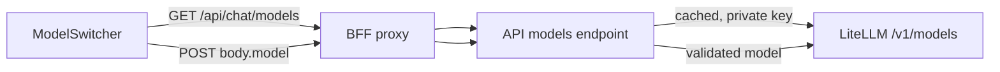

# Chat model switcher

Status: implemented (PR #48).

## Problem Statement

Every chat call is pinned to one model from `API_CHAT_MODEL`. Users cannot
pick a faster or a smarter model. The LiteLLM gateway already holds the
authoritative list of models the gateway key may call, but nothing exposes
it.

## Solution

The OpenUI `ModelSwitcher` sits in the thread header. The API serves the
allowed model list by asking the gateway at runtime, with a short cache.
The chosen model travels in the completion body and is validated server
side. The gateway key never leaves the API process.

## User Stories

1. As an authenticated member, I want a model picker in the chat header, so
   that I can choose which model answers.
2. As an authenticated member, I want the picker to show only models that
   actually work, so that no pick fails.
3. As an authenticated member, I want my last pick remembered, so that a
   reload keeps my choice.
4. As an operator, I want the model list to come from the gateway, so that
   adding a model needs no API deploy.
5. As an operator, I want the model id validated server side, so that a
   crafted request cannot reach models outside the allowed set.
6. As an operator, I want requests without a model to keep today's default,
   so that older clients and tests are unaffected.

## Implementation Decisions

### Model list: dynamic, cached

- New API endpoint `GET /api/chat/models` (session required). It calls
  `GET {API_LITELLM_URL}/v1/models` with the existing gateway key and maps
  the result to `[{id, name, default?}]`. The configured `chat_model`
  entry carries `default: true` (appended when the gateway list lacks it)
  so the web can mark the API default without a second source.
- LiteLLM scopes `/v1/models` to the key's model allowlist when the key has
  one. A key with no restriction returns the full registry, including
  wildcard routes not callable by exact name. The gateway therefore stays
  the final enforcer; the cached list is the UI and validation source, not
  a security boundary on its own. `/model/info` is not used; it needs a
  stronger key scope.
- The response is cached in-process with a TTL from a new frozen
  `ChatConfig` field (`API_CHAT_MODELS_TTL_SECONDS`, 60 s default).
- The models endpoint and the validator share one cached set. On listing
  failure the cache keeps its last value; if it was never fetched, the set
  is just the default model. Unknown ids answer 422 with that set, so the
  two paths can never disagree.

### Per-request model

- `CompletionIn` gains optional `model: str | None`.
- The API validates the id against the cached allowed set (same set the
  models endpoint serves; see above). Unknown id answers 422. The gateway
  remains the final enforcer regardless.
- `Gateway.stream` takes the model per call. Absent model falls back to
  `chat_model`. Current behavior is the default path.

### Web

- `chat-config.ts` wraps the `fetchLLM` fetch. The wrapper clones the
  request and merges the current model id from a ref. The static `body`
  option of `fetchLLM` cannot change per request; rebuilding the `ChatLLM`
  on change would reset SDK stream state.
- `AgentInterface.ThreadHeader` hosts the `ModelSwitcher` (direct child
  slot of `AgentInterface`, like the other slots). A spike confirms whether
  the built-in header content coexists with children.
- Last choice persists in local storage; default on first visit is the
  API's default model.
- BFF gains a `/api/chat/models` relay. It stays a dumb proxy. No gateway
  material reaches the browser.

### Reasoning models

`merge_reasoning_content_in_choices` is already on in the gateway image, so
reasoning folds into `delta.content` for every model. The 300 s gateway
read timeout stays.

## Testing Decisions

- API tests with a fake gateway override: models mapping and caching, TTL
  expiry, fallback on listing failure, model pass-through, 422 on unknown
  id, default fallback when absent.
- BFF tests: cookie forwarding and byte relay for the models route.
- Web Vitest: the fetch wrapper merges the live model id; the switcher
  persists the choice.

## Out of Scope

- Per-thread model memory (needs a `chat_threads.model` column; follow-up).
- Cost or quota display per model.
- Gateway administration (registering models stays a LiteLLM DB task).

## Open Questions

1. Wildcard models (`openai/*`): if the gateway registers one, do we pin
   the listing to exact-name entries only (proposed) or expand?
2. Grouping and `recommended` badges on the picker: which model earns them
   per environment?
