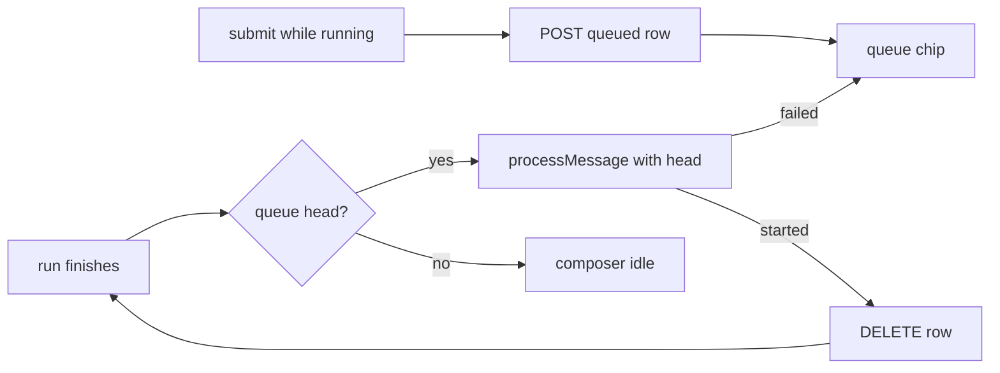

# Chat queued messages

Status: implemented (PR #47).

## Problem Statement

While the assistant is generating, the composer is locked. The user must
wait, watch, and retype. Anything typed ahead is lost. The queue should be
persistent: it survives reloads and device switches, because it lives
server side with the thread.

## Solution

Submitting while a run is active stores the message as a queued row tied to
the thread and shows it as a chip above the composer. When the run ends,
the web pops the queue head and sends it as a normal message. Queued
messages can be edited or removed before they send.

## User Stories

1. As an authenticated member, I want to type and submit while the
   assistant answers, so that I do not wait idle.
2. As an authenticated member, I want my queued messages to survive a
   reload, so that nothing I typed is lost.
3. As an authenticated member, I want to edit or remove a queued message
   before it sends, so that I stay in control.
4. As an authenticated member, I want each queued message answered
   separately, so that replies stay on topic.
5. As an authenticated member, I want my queue bound to my session and
   thread, so that nobody else sees or sends it.

## Implementation Decisions

### SDK facts (verified in the pinned dist)

- `processMessage` returns early while `isRunning`, and the composer blocks
  sends while running. The SDK cannot queue natively.
- `appendMessages` only mutates local state; it persists nothing. The next
  run sends the full local history, and the API replaces stored history
  with it. So an appended-but-unsent message is lost if the tab closes
  first. Server-side rows are the fix.

### Queue model

One migration adds `chat_queued_messages` (extension table):

- `id` UUID pk, `thread_id` FK chat threads cascade, `user_id` FK users
  cascade, `tenant_id` text, `seq` int, `content` JSONB with a non-empty
  check, `created_at` timestamptz.
- Index on `(thread_id, seq)`.

### API

Session-scoped, owner-checked, verb-suffixed paths like the threads router:

| Operation | Method and path                        | Notes                          |
| --------- | -------------------------------------- | ------------------------------ |
| Enqueue   | `POST /api/threads/queue/create`       | thread id + content, capped    |
| List      | `GET /api/threads/queue/get?thread_id=`| ordered by seq                 |
| Remove    | `DELETE /api/threads/queue/delete/{id}`|                                |
| Edit      | `PATCH /api/threads/queue/update/{id}` | content only                   |

The queued text never reaches the model from the server. The browser's
next completion call carries it as normal history. The completion endpoint
needs no change. Queued content is text only in v1; the attachments spec
owns the composer and explains why.

### Web dispatch loop

- A queue hook holds the active thread's queue in React state, hydrated
  from the API on thread load, mirrored on every change.
- Composer stays usable while running (custom composer slot; the
  attachments spec owns it and this spec builds on it). Submit while
  running enqueues.
- The store behind the SDK is not exported, so there is no subscription to
  watch. The falling edge of `isRunning` is detected where it is available:
  the custom composer receives `isRunning` as a prop, and an effect there
  fires the dispatch when it turns false.
- Dispatch: take the head, call `processMessage` with it, and delete its
  row only after the run starts successfully. A failed or aborted
  dispatch keeps the row, retries the head once, then stops and shows a
  failed state with a manual send. No auto-loop. One message per run.

### Edge cases

- Tab closed mid-queue: rows stay; next visit shows chips with a send
  affordance. Runs are browser-driven, so nothing sends in the background.
- Thread switch: queue is per thread; the hook rehydrates on switch.
- Thread deleted: cascade removes its queue rows.
- Abort: cancels only the current run; dispatch continues with the next
  head unless the user removes it.

## Testing Decisions

- API HTTP tests: enqueue caps, owner isolation, ordering, edit, remove,
  cascade delete with thread.
- Web Vitest with fake timers: dispatch loop on the falling edge, retry
  once on error, chip add/remove/edit, rehydration on thread switch.
- BFF relay tests for the new paths.

## Out of Scope

- Server-side dispatch without an open browser.
- Merging several queued messages into one turn.
- Queue across different threads in parallel.

## Open Questions

1. Auto-send on next thread open (proposed) or an explicit "Send queued"
   button?
2. Cap on queue depth per thread (proposed: 10)?
