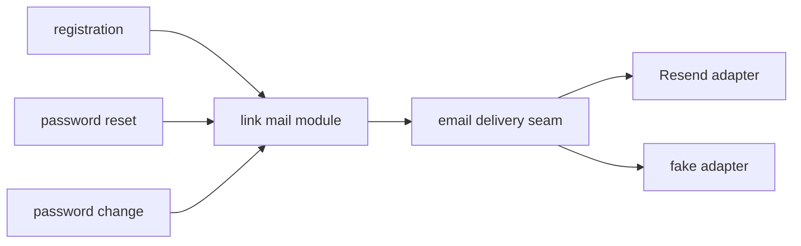

# Spec: Magic link mailer

Status: implemented (PR #42).

Seam: the app side of the shared email delivery seam gains one link
mail module in the API composition. The package stays app agnostic.
Callers shrink to one call each.

## Problem Statement

Three modules mail links or notices: registration, password reset, and
password change. Each declares the app name. Each builds its link by
hand. Each repeats the best effort send guard that swallows and logs
mail failure. A rename or a mail policy change touches three files and
drifts.

## Solution

One module in the API mail composition owns link mail. It holds the
app name, builds the link from the configured base URL plus a path and
query, renders the template through the seam, and sends best effort
with one logging shape. Registration, password reset, and password
change call it with a template, a recipient, and, when the mail carries
one, a typed link. None of
them declares the app name or builds a link again.

## User Stories

1. As a maintainer, I want one home for the app name, so that a rename touches one file.
2. As a maintainer, I want one link builder, so that base URL handling cannot drift between flows.
3. As an operator, I want mail failure to stay best effort, so that a dead mail vendor never turns a sign up into an error page.
4. As a maintainer, I want one logging shape for swallowed mail, so that on-call reads one pattern.

## Implementation Decisions

- The module lives on the app side of the seam, in the API mail
  composition. The email package gains nothing app specific.
- The interface takes a template, a recipient, and, for link mail, a
  typed link (path plus query parts). It injects the app name and the
  base URL itself.
- The app name is declared once, in the API composition, and imported.
- The best effort policy stays: a send failure logs one warning and the
  caller's answer never changes.
- The three call sites keep their templates and their neutral answers.
  Only the plumbing moves.

## Testing Decisions

- Existing mail pins keep passing: one send per request, link holds the
  raw token, fake adapter sees the send.
- A new test pins the best effort contract: a raising sender still
  yields the caller's neutral answer.
- A wiring test pins that all three call sites use the one module, so a
  fourth copy of the app name cannot land quietly.

## Out of Scope

- New templates or copy changes.
- Retries, queues, and delivery receipts.
- Provider changes beyond the existing Resend adapter.

## Further Notes

- Sibling prior art: the email delivery seam and its rendered_send
  helper. This spec sits one level above that helper.
- Source review: improve-codebase-architecture run of 2026-10-08,
  candidate 3.
