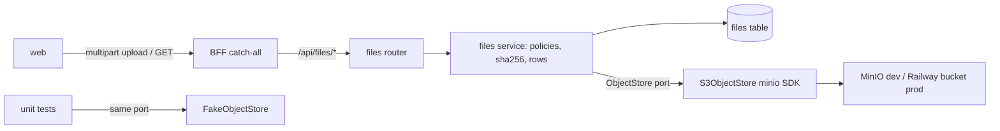

# Object storage

Status: implemented.

Seam: one storage package owns every object byte. Callers use a small
store port. An S3-compatible adapter serves dev (MinIO) and prod
(Railway bucket or AWS S3). A fake adapter serves tests. The api owns
file metadata rows and the browser-facing file endpoints.

## Problem Statement

Attachments and artifacts need binary content somewhere that is not
Postgres. Chat attachments today travel as data URLs inside JSONB
history. The artifacts spec would pin content in a JSONB column. Both
specs defer "reference storage" to a separate spec that does not exist.
There is no object store, no file metadata table, and no upload
endpoint. Bytes in Postgres bloat rows, slow backups, and cap content
at what JSONB tolerates.

## Solution

Add a `storage` workspace package: a single `ObjectStore` port with an
S3 adapter and an in-memory fake. The api gains a `files` extension
table recording bucket, object key, owner, tenant, mime type, size,
and sha256 per stored object, plus `/api/files` endpoints that proxy
uploads and downloads through session auth. MinIO joins both compose
stacks as the dev object store. Prod points the same adapter at a
Railway bucket or AWS S3 by env only. The attachments and artifacts
specs amend their storage sections to consume the registry.

## User Stories

1. As a developer, I want one store port for all object bytes, so that
   no call site wires an S3 client.
2. As a developer, I want a fake adapter, so that unit tests assert
   object behavior without a network.
3. As a developer, I want one adapter for MinIO and AWS S3, so that dev
   and prod share a code path.
4. As an authenticated member, I want to upload a file through the API,
   so that I can attach it to a feature.
5. As an authenticated member, I want to list and fetch my files, so
   that I can reuse them.
6. As an authenticated member, I want to delete a file I own, so that I
   control my content.
7. As an authenticated member, I want to mark a file as belonging to my
   tenant, so that it survives my account being deleted.
8. As a tenant member, I want to read files my tenant owns, so that org
   content stays reachable after the uploader leaves.
9. As a tenant admin, I want to delete tenant-owned files, so that org
   storage stays manageable when the uploader is gone.
10. As an operator, I want a deleted user's private files purged (row
    and object), so that personal content does not outlive the account.
11. As an operator, I want uploads mime-checked and size-capped per
    purpose, so that one request cannot exhaust storage or memory.
12. As an operator, I want every file row tenant-scoped with uploader
    attribution, so that one user never reads another's private bytes.
13. As an operator, I want a sha256 recorded per object, so that
    corruption is detectable and dedup is possible later.
14. As an operator, I want MinIO in compose, so that
    `docker compose up` gives a working store; the api creates the
    bucket on first write.
15. As an operator, I want prod set by env only, so that no code change
    is needed to reach a Railway bucket or AWS S3.
16. As a maintainer, I want metadata in Postgres and bytes in S3, so
    that each store keeps what it is good at.
17. As a maintainer, I want keys prefixed by purpose and tenant, so
    that buckets stay navigable and per-tenant purge is easy.
18. As a maintainer, I want object delete best-effort after commit, so
    that a storage outage never strands the API.
19. As a maintainer writing a consumer spec, I want a service-level
    write path and `file_id` references, so that server-generated
    content (artifacts) lands in the same registry as uploads.

## Implementation Decisions

### Package: `storage` (new workspace member)

- `storage.ports` defines the seam. `ObjectStore` is a Protocol:
  `put(bucket, key, data, *, content_type, size) -> StoredObject`,
  `get(bucket, key) -> ObjectContent` (context-managed byte stream plus
  stat fields), and `delete(bucket, key) -> None` (idempotent). Typed
  errors: `StorageError`, `ObjectNotFound`.
- `S3ObjectStore` wraps the `minio` Python SDK. Chosen over boto3:
  smaller surface, sync (matches the api's sync session style), S3
  multipart handled internally past part size, and it targets
  S3-compatible stores first. The client is lazy: construction never
  touches the network, so boot without MinIO only fails on the first
  file call.
- `FakeObjectStore` keeps objects in a dict for tests, mirroring
  `FakeEmailSender`.
- `build_object_store(config)` builds the S3 adapter once. Routes
  receive the port through `app.state` and a dependency, same shape as
  `get_email_sender`; tests swap `app.state` for `FakeObjectStore`.
- Objects are immutable. Keys embed a fresh uuid, so `put` never
  overwrites. Updates are new keys plus a metadata swap.

### Config

- New `StorageConfig` group in `api.config`: `s3_endpoint` (default
  `http://localhost:9000`, matching compose), `s3_access_key` and
  `s3_secret_key` (dev defaults matching compose), `s3_bucket` (default
  `taipan`), `s3_region` (default `us-east-1`; Railway buckets take
  `auto`), `upload_max_bytes` (default 10 MiB).
- Env vars: `API_S3_ENDPOINT`, `API_S3_ACCESS_KEY`,
  `API_S3_SECRET_KEY`, `API_S3_BUCKET`, `API_S3_REGION`,
  `API_FILES_MAX_BYTES`. The api env example documents all of them.
  The devcontainer app env points at `http://minio:9000`.

### Table: `files` (one migration)

- Columns: `id` uuid pk `gen_random_uuid()`, `tenant_id` text not null
  (the session guard enforces it), `scope` text not null checked
  against (`user`, `tenant`), `created_by_user_id` int null FK users
  restrict, `purpose` text not null, `bucket` text not null,
  `object_key` text not null, `filename` text not null, `content_type`
  text not null, `size_bytes` bigint not null `>= 0`, `sha256` text not
  null length 64, `created_at`, `updated_at`.
- Check: `scope = 'tenant' OR created_by_user_id IS NOT NULL`. Private
  files always carry an uploader; tenant files may lose theirs.
- `unique (bucket, object_key)`; index `(created_by_user_id,
  tenant_id, created_at)` covers private listing and the FK lookup;
  partial index `(tenant_id, created_at) WHERE scope = 'tenant'` for
  shared listing.
- `created_by_user_id` is attribution, not a delete trigger. A
  `CASCADE` would drop rows while leaking S3 objects, and would kill
  tenant files with the uploader. `RESTRICT` forces every user-delete
  path through the files service, which owns the ordering.
- `tenant_id` carries no FK, matching every tenant-carrying table
  today. Tenant deletes enforce nothing at the DB; they rely on the
  `detach_tenant` contract below.
- Key layout: `{purpose-prefix}/{tenant_id}/{file_uuid}` where each
  purpose policy declares its prefix (`attachment` to `attachments/`,
  `artifact` to `artifacts/`). Opaque; the filename lives only in the
  row.
- No status column: the proxy flow writes object then row, so every row
  is ready. The presigned two-phase flow adds `pending` when it lands.

### Files module in the api app

- One service module owns: the purpose policy map (purpose to key
  prefix, mime allowlist, max bytes, browser-uploadable flag),
  filename sanitization, streaming sha256, row-and-object
  choreography, keyset listing.
- Service surface for consumers and endpoints alike: `store_upload`
  (browser bytes), `store_bytes` (server-generated content), `open`
  (metadata plus a byte stream), `delete`, `list_page`, `detach_user`,
  `detach_tenant`.
- Scope decides lifetime and audience. `scope = 'user'` files are
  private: only the uploader reads or deletes them. `scope = 'tenant'`
  files belong to the tenant: any member of `files.tenant_id` reads
  them; the uploader or a tenant `admin` deletes them. Tenant files
  outlive the uploader only while the tenant lives; a tenant delete
  purges every file in it.
- Commit ownership: service calls take the caller's session. Endpoint
  flows let the service commit itself (the `_persist` precedent in
  chat completion); consumers commit so the file row lands in the same
  transaction as their own rows. Upload writes the object, inserts the
  row, commits; a failed commit compensates with an object delete.
  Delete removes the row, commits, then deletes the object
  best-effort. Orphaned objects are a logged GC follow-up.
- `detach_user(session, user_id)` purges `scope = 'user'` rows and
  objects, and nulls `created_by_user_id` on the user's `tenant`-scope
  rows. `detach_tenant(session, tenant_id)` purges every file row and
  object in a dying tenant. Both wrap their mutations in
  `tenant_scope(<victim tenant>)` so the flush guard passes under the
  caller's ambient scope.
- The user-delete flow (`users.remove`) already deletes the user row,
  the personal `Tenant` row, and its DEK. The files ordering mirrors
  it: consumer rows that hold `file_id` references die first (each
  consumer owns its cleanup), then `detach_user`, then the user row,
  then `detach_tenant` per deleted tenant, then the tenant rows.
  `RESTRICT` on `created_by_user_id` guarantees `detach_user` is not
  skipped; `detach_tenant` is a contract, not DB-enforced.
- Initial policies: `attachment` is browser-uploadable (image
  allowlist plus `application/pdf` and `text/plain`, scopes `user` and
  `tenant`, capped by `upload_max_bytes`); `artifact` is service-only
  (`application/json`, scope `user`) so no browser can mint one
  through POST.
- Consumer tables hold `file_id` FK references with
  `ON DELETE RESTRICT`; the api maps the violation to 409 on generic
  delete. This path stays untestable until the first consumer table
  lands; it is a contract note, not a v1 test.

### Endpoints (`/api/files`, session scoped)

- `POST /api/files` multipart (`purpose`, `scope`, `file`): policy
  check including allowed scopes, stream to S3, insert row, return
  metadata. `scope` defaults to `user`. 413 over cap, 415 bad mime,
  400 unknown purpose or disallowed scope.
- `GET /api/files`: list of files the principal may read (own
  `user`-scope plus same-tenant `tenant`-scope), `purpose` and `scope`
  filters, `cursor`/`limit` keyset paging, newest first.
- `GET /api/files/{id}`: metadata, scope-aware visibility.
- `GET /api/files/{id}/content`: streams the object. `Content-Type`
  and `Content-Length` come from the row, never the client (the BFF
  strips `Content-Length` on responses anyway; the value still matters
  in-network). `Content-Disposition: attachment` with sanitized
  `filename*` (inline only for `image/*`),
  `X-Content-Type-Options: nosniff`, `Cache-Control: private`.
- `DELETE /api/files/{id}`: `user`-scope needs the uploader,
  `tenant`-scope needs the uploader or a tenant `admin`; 409 once a
  consumer row references it (no consumer tables exist in v1).
- A request-size middleware bound wraps the router. It counts bytes on
  the ASGI receive stream, not `Content-Length`: the BFF strips that
  header and forwards chunked. Every endpoint stamps `tenant_id` and
  applies the scope rules: `user` files need
  `principal.user_id = created_by_user_id`, `tenant` files need a
  matching `tenant_id`.
- The BFF proxy aborts upstream calls at 30 seconds, which bounds both
  directions: `upload_max_bytes` defaults to 10 MiB to fit inside it,
  and a download that outruns the budget dies mid-stream. Larger
  transfers need a dedicated BFF files route with a raised `timeoutMs`
  (the proxy already takes the knob).

### Docker

- Root compose gains a digest-pinned `chainguard/minio` service (API
  on 9000, console on 9001, named volume). MinIO pulled its official
  `minio/minio` and `minio/mc` images from Docker Hub and Quay, so the
  plan of record changed: no `mc` init service, no in-container
  healthcheck (the Chainguard image is shell-less), and the api's S3
  adapter creates the bucket lazily on first `put` instead. Dev-only
  root credentials committed like the Postgres password.
- The devcontainer compose mirrors the service with no host ports.
- Prod needs no container: a Railway bucket (S3-compatible,
  Tigris-backed) or AWS S3 differs only in env vars.

### Wiring and gates

- The workspace manifests and the api package gain the `storage`
  member; the api image gains its two COPY lines per the check-docker
  gate. The lockfile regenerates with `minio` pinned to a release at
  least a week old. The api also gains `python-multipart`: FastAPI
  `File`/`Form` fields raise at route registration without it.
- No web changes: the catch-all already proxies `/api/files/*`,
  including multipart bodies and binary responses.

### Consumer amendments (land with this spec's docs)

- `chat-attachments`: its "separate spec" for upload and reference
  storage resolves to this one. Phase-1 data URLs stay unchanged.
- `chat-artifacts`: `chat_artifacts.content` JSONB becomes `file_id`
  FK to `files`; content writes through `store_bytes` under the
  `artifact` purpose. The amended spec owns the lifecycle details.

## Testing Decisions

- Port conformance: one test module exercises the `ObjectStore`
  contract against `FakeObjectStore` always and `S3ObjectStore` when
  MinIO is reachable, skipping otherwise like the Postgres tests.
- Fake-adapter tests assert captured objects, stat fields, idempotent
  delete, and not-found errors.
- API HTTP tests inject `FakeObjectStore` through `app.state`: upload
  writes row plus object under policy (size, mime, purpose, scope),
  download streams with the pinned headers, `user`-scope isolation and
  `tenant`-scope member reads hold, delete removes the row then the
  object, keyset listing pages, and oversized bodies get 413.
- Lifecycle tests pin the scope contract: `detach_user` purges private
  rows and objects and detaches tenant rows, a user delete without it
  fails on `RESTRICT`, `detach_tenant` purges everything in a dying
  tenant, mutations pass the flush guard under a foreign ambient
  scope, and a tenant file outlives its uploader only while the
  tenant lives.
- Config tests pin env parsing and defaults only; adapter choice is
  not config-driven.
- One migration test asserts the `files` shape (columns, unique,
  index).
- Run the structural check then the test smell review on touched
  tests. A test that cannot fail is removed.

## Out of Scope

- Presigned upload or download URLs and direct browser-to-S3 traffic
  (needs CORS plus a public endpoint; follow-up). Railway bills service
  egress on proxied uploads, which is the real argument for it.
- Object versioning, retention and lifecycle rules, dedup on sha256.
- Per-user or per-tenant quotas; the orphan-object sweep job.
- Antivirus or magic-byte sniffing beyond declared type plus
  allowlist.
- Encryption at rest for object bytes (repo-wide at-rest work is a
  separate spec).
- Public or share-scoped file access (shared-thread images, public
  artifacts); consumers add token-scoped reads.
- The consumers themselves: attachments phase 2 and artifacts land in
  their own specs.

## Further Notes

- Railway buckets inject `AWS_*` credentials; ops maps them to the
  `API_S3_*` vars.
- File references held inside JSONB (message parts, future artifact
  payloads) get no FK enforcement. Consumers must tolerate a dangling
  `file_id` by answering 404 on content reads.
- The users service already deletes the personal tenant on account
  removal; `detach_tenant` runs inside that flow from day one.
  Multi-member org tenants reuse the same call when they arrive.
- The companion visual lives beside this file in `spec.html`. It shows
  the port seam, the data flow, and the test seam.
