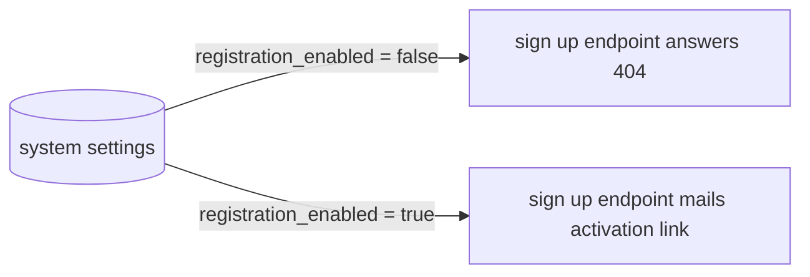

# Spec: Registration

Status: implemented (PR #39).

Seam: a registration module owns token rules over an injected
session. The shared email-delivery seam owns all mail sending with
a Resend adapter. A system settings module owns the platform
settings store. Registration reads the sign up switch through it.
Routers stay thin.

## Problem Statement

There is no self sign up. New users need an admin to make accounts. Growth needs open sign up. The flow must stay safe. Spam accounts must not get in. Passwords must not be set over an open form. Sign up also needs an off switch. The platform must start closed. A system owner opens it on purpose.

## Solution

The visitor enters an email only. The system sends an activation link by email. The link opens a set password page. The user sets a password. The system logs the user in at once. The web lands on /dashboard. Login keeps its form. Login also lands on /dashboard. All mail goes through the shared email delivery seam. Tokens are single use, hashed at rest, and short lived. Sessions reuse the existing sessions table pattern.

A system settings table holds platform settings as key value rows. The first key is registration_enabled. It defaults to false, so sign up starts closed. With the switch off, the sign up endpoint answers 404. The web sign up route closes too. It answers 404 and no sign up link renders. Only a system owner can flip it, from the web app.

## User Stories

1. As a visitor, I want to sign up with my email only, so that I can start fast.
2. As a visitor, I want a clear note that a mail is on the way, so that I know what to do next.
3. As a visitor, I want to get an activation mail soon after sign up, so that I am not stuck.
4. As a new user, I want to open the activation link, so that I can set my password.
5. As a new user, I want to set my password on a plain page, so that I finish sign up.
6. As a new user, I want to be logged in right after I set my password, so that I skip a second login.
7. As a new user, I want to land on /dashboard after activation, so that I know where I am.
8. As a returning user, I want to log in with email and password, so that I get back in.
9. As a returning user, I want to land on /dashboard after login, so that login and activation agree.
10. As a signed in user, I want /dashboard to show my session works, so that I trust the login.
11. As a visitor with no session, I want /dashboard to send me to login, so that private pages stay shut.
12. As a user with a used link, I want a clear expired note, so that I can ask for a new mail.
13. As a user with an old link, I want the link to fail after expiry, so that old mails do not work forever.
14. As a user who clicks twice, I want the second use to fail, so that a link works one time only.
15. As a user with a bad link, I want a clear invalid note, so that I do not guess.
16. As an existing user, I want a new sign up with my email to resend safely, so that I am not locked out.
17. As an operator, I want no password stored before activation, so that half accounts cannot log in.
18. As an operator, I want token hashes at rest and not plain tokens, so that a leak shows less.
19. As an operator, I want sign up closed by default, so that the platform opens only on purpose.
20. As a system owner, I want to flip the sign up switch in the web app, so that I control registration.
21. As a visitor, I want a 404 when sign up is closed, so that a closed platform shows no sign up door.
22. As a visitor, I want no sign up link anywhere in the app while sign up is closed, so that no door shows, not even on the login page.

## Implementation Decisions

- Registration is split in two steps. Step one takes an email and mails a link. Step two takes the token plus a new password and makes the session.
- A system settings table stores platform wide settings as key value rows. It is global. It holds no tenant data.
- The first key is registration_enabled and it defaults to false. The platform starts with sign up closed.
- The sign up request endpoint reads the switch first. With registration off it answers 404 to every caller. With it on, known and unknown mail get the same answer, so user lists stay shut.
- The activation endpoint does not read the switch. A link mailed while sign up was open still works.
- The registration module owns the token rules and the two endpoints. The web owns the two pages and the redirect to /dashboard. Neither side owns the other job.
- All mail goes through the one shared email delivery seam. The seam takes a template name plus typed data plus recipient. A Resend adapter backs prod. Registration calls the seam. It never calls a mail vendor direct.
- Activation tokens are random, single use, hashed at rest, and short lived. Plain tokens live only in the mailed link. The store holds hashes plus expiry plus used flags.
- The request endpoint always answers the same. It mails only for new mail. It never says if an email exists. This keeps user lists shut.
- The activation endpoint checks hash match, expiry, and unused state in one pass. It then marks the token used, sets the password hash, and makes a session. A replay of the same link fails.
- Password rules match login rules. One hasher and one check serve both paths. Activation sets the same hash login reads.
- Session handling reuses the existing sessions table pattern. Activation and login mint sessions the same way. The cookie shape and lookup stay one path.
- After activation the web lands on /dashboard. After login the web lands on /dashboard. One landing rule serves both flows.
- The set password page reads the token from the link. It posts token plus password. It shows invalid or expired states from the endpoint result. It never decides token state on its own.
- Only a system owner may change a system setting. The API guards the settings endpoint with require_system_owner. The web settings page reads and writes the switch through the BFF.
- A public read of the switch serves the web through the BFF. The read exposes the switch and nothing else. With the switch off, the register route answers 404 and no sign up link renders anywhere, including the login page. With it on, the page renders. The API gate holds even for a page loaded before a flip to off.

## Testing Decisions

- API tests cross HTTP only with a real test database. They cover request with a fresh email, resend for the same email, same answer for known and unknown mail, and no mail vendor call past the seam.
- Token tests pin single use, hash at rest, and short expiry. They use a valid link once with success, reuse with failure, tampered link with failure, and old link with failure.
- Activation tests pin account effects. They check no login before password is set, login works after, landing target is /dashboard, and password checks match login.
- Activation tests pin the switch bypass. A link from an open period still works after the switch flips off.
- Mail tests use the fake adapter of the email delivery seam. They assert one send per new request, link holds the token, and no vendor SDK in the registration path.
- Web tests pin redirects and states. They check activation success lands on /dashboard, login success lands on /dashboard, no session on /dashboard sends to login, and bad links show invalid or expired notes.
- Web tests use pure choice functions with stubbed fetch. No full page render is needed for the redirect and state rules.
- Settings tests pin the default. A fresh database answers 404 on sign up until the switch flips to true.
- Settings guard tests pin the role. A system owner changes the switch. Any other role and an anonymous caller get denied.
- Web settings tests pin the wiring. The page reads the switch and posts a change through the BFF.
- Web route tests pin the closed door. With the switch off, the register route answers 404 and no sign up link renders anywhere. With it on, the route renders.

## Out of Scope

- Password reset and forgot flows.
- Invite only sign up and admin made accounts.
- Extra profile fields at sign up.
- Social login and passkeys.
- Rate limits and captcha.
- Org tenants and extra roles.
- Session rotation and device lists.
- More settings beyond the registration switch.

## Further Notes

- The visual lives beside this file in spec.html. It shows the module seam and the test seam.
- Cross spec pact holds. Mail uses the shared email delivery seam with a Resend adapter. Tokens are single use, hashed at rest, and short lived. The web lands on /dashboard after login or activation. Sessions reuse the existing sessions table pattern. System settings are global key value rows and sign up starts closed.
