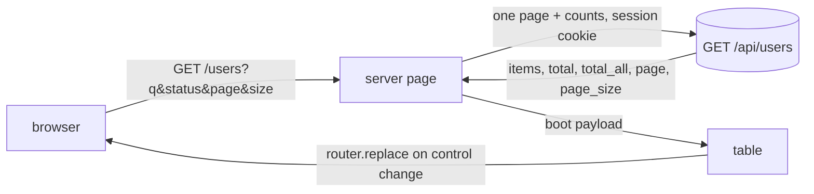

# Spec: Users List SSR Paging

Status: implemented (PR #50).

Seam: the API owns search, filter, count, and paging. The web page is
a server component that loads exactly one page of rows per render.
The URL owns list state. The chat surface keeps rendering the view.
This supersedes the client paging decision in the users-table spec.

## Problem Statement

The users list loads every account into the browser. Search, filter,
and paging all run client side. The pager is decorative: it slices a
fully loaded array. Cost grows with the user count on every page
open. The list state lives only in React state, so no view can be
shared or bookmarked. A refresh drops search, filter, and page.

## Solution

The API gains query params on `GET /api/users` and answers one page
plus counts. The web server component reads the URL, fetches that
one page with the caller's session, and renders rows on the server.
Controls write URL params through the router. Each change re-renders
the server component with fresh rows. The browser never holds the
full user set. Page count is computed from the returned total.

## User Stories

1. As a system owner, I want the server to send only the rows of the
   current page, so that the payload stays small as users grow.
2. As a system owner, I want the page count computed from the total,
   so that the pager reflects data I never downloaded.
3. As a system owner, I want search, filter, page, and size in the
   URL, so that I can copy a link to the exact view.
4. As a system owner, I want a shared link to open server rendered
   with that state, so that the view appears with its first paint.
5. As a system owner, I want a refresh to keep my view, so that
   reloading never resets the list.
6. As a system owner, I want search matches narrowed on the server,
   so that filtering does not depend on what the client downloaded.
7. As a system owner, I want the match count and the grand total, so
   that I still know how much the filters removed.
8. As a system owner, I want a deep link to one user's detail, so
   that I can share an account view.
9. As a system owner, I want garbage URL values to fall back to
   defaults, so that a broken link never breaks the page.
10. As a system owner, I want a page beyond the last to clamp, so
    that stale links still show rows.
11. As a system owner, I want the old content to stay visible while
    the next page loads, so that controls do not flash empty.

## API Contract

- `GET /api/users` accepts `q`, `status`, `page`, `page_size`.
- `q` is a case insensitive substring match on email. Surrounding
  whitespace is trimmed before matching. The value is capped at 200
  characters. Longer input answers 422.
- `status` is `all`, `active`, or `inactive`. Default `all`.
- `page` is an integer of 1 or more. Default 1. Zero or negative
  answers 422.
- `page_size` is 10, 25, or 50. Default 10. Any other value answers
  422.
- The response is `UserPageOut`: `items`, `total`, `total_all`,
  `page`, `page_size`. `total` counts the filtered set and drives the
  page count. `total_all` counts every user and feeds the count line.
- A `page` beyond the last clamps down. The response `page` carries
  the effective page. An empty database answers page 1 with no items.
- Rows keep `id` ascending order, so paging is stable.
- LIKE wildcards inside `q` are escaped, so `%`, `_`, and `\` match
  literally.
- The old flat array body is removed. The web list is its only
  runtime consumer and changes in the same feature. Four API test
  files read the flat body: `test_users`, `test_gated_users`,
  `test_user_detail` (its `test_list_shape_unchanged` is deleted),
  and `test_registration_http`. Their list assertions are rewritten
  for the paged body. `test_roles` reads only the status code and
  survives unchanged. The detail, activation, and delete endpoints
  stay unchanged.

## Implementation Decisions

- API service: a new `listing` module beside the users service owns
  filters, counts, clamp, and slicing. The service file sits near the
  line cap, so the paging code gets its own home. It takes a plain
  session, so tests need no HTTP. The router stays a thin adapter.
- API router: FastAPI `Query` params with the enum and bound
  constraints. Validation failures answer 422 before the service runs.
- Web URL params: `q`, `status`, `page`, `size`, and `user` on
  `/users`. Defaults are omitted from the URL, so a clean `/users`
  means page 1, size 10, no filters. `size` maps to the API's
  `page_size` in one place.
- URL parsing is one pure function. It normalizes garbage to
  defaults: unknown status, unknown size, and non numeric page and
  user values all fall back. It truncates `q` to 200 characters and
  forces `page` to an integer of 1 or more. The web therefore never
  triggers an API 422 from a shared link.
- The users page is a server component. It parses the URL, fetches
  one page from the API with the session cookie and `no-store`, and
  passes the payload down through `ChatApp` to the table. The fetch
  helper lives beside the other server fetchers in the upstream
  module. It guards the body shape before render.
- The URL is the single source of truth on the client. Controls call
  `router.replace` with rebuilt params inside a transition. The old
  payload props stay on screen until the new server render lands.
  The parsed filters travel down with the payload, so controls
  rebuild params without re-reading the URL.
- The search field keeps local state and debounces its navigation.
  Any other control change cancels a pending flush, and the flush
  merges the latest text into the current params. The field reseeds
  from the incoming URL value when no flush is pending, so a pasted
  link updates the text.
- Any control change replaces the URL. Search, status, and size
  changes also reset the page to 1, as the old reducer did.
- Replacing the URL keeps history clean. Copying the address bar
  still shares the view.
- Display follows the payload, not the URL, for page number. A
  clamped deep link shows the effective page. The URL is not
  rewritten, so clamping stays idempotent. A copied clamped link
  still opens the same clamped view.
- Detail selection moves to the `user` param. The chat surface drops
  its detail state. Selecting a row keeps filter params, and back
  returns to the same page of the list.
- The owner gate stays as is: `requireAccount`, the system owner
  check, and the redirect for everyone else.
- ChatApp's `syncUrl` gains a guard: same path keeps the query
  string, so surface navigation never strips list state.
- Error state is a server render: the pinned error line plus a retry
  control that refreshes the route. The list no longer fetches on
  the client. Detail and account actions stay client side.
- The removed client helpers go with their tests: the flat loader,
  the reducer, and the client side search, filter, and slice. New
  pure helpers own URL parsing, URL building, payload guarding, page
  count, and the count line.
- All files stay under the 300 line cap. The count line reads
  `N of M users` from `total` and `total_all`.

## Testing Decisions

- API integration tests run through the HTTP client against the
  container database. They seed known users. The pins: paging math
  across pages, filter and search combined with paging, both counts,
  wildcard escaping, clamp past the last page, and default params.
  Bad `page`, `page_size`, `status`, and long `q` each answer 422.
- The service level clamp and escape rules get direct unit coverage
  beside the HTTP tests.
- Web tests pin the pure layer. URL parsing normalizes garbage.
  Building omits defaults and round trips through parsing. The
  payload guard rejects wrong shapes. Page count math holds for
  sizes 10, 25, and 50, including the empty total that still
  reports one page. The count line format stays exact.
- Web tests pin the server fetch helper with stubbed fetch: session
  cookie forwarded, query string built from parsed filters, error
  bodies mapped to messages, wrong shapes rejected.
- Threads cursor pagination keeps its existing API HTTP coverage.
  Settings seeding rides the existing resolver and switch reducer
  tests. Account and overview gain no fetch, so they gain no test.
- Web tests pin the threads storage wrapper: the seed answers only
  the first list call without a cursor, cursor calls pass through,
  and a null seed falls straight through to the client fetch.
- No render tests. The repo has no render harness. This known gap
  stays unchanged.
- Full gates: pytest with the pinned container database, vitest, web
  lint, and web build.

## Additional Surfaces in This Change

- Threads list: the API already cursor-paginates threads (20 per
  page). The private layout server-fetches the first page with the
  session cookie. A small `ChatStorage` wrapper answers the SDK's
  first `listThreads` call from that seed and hands later cursor
  pages to the client fetch. A failed seed falls back to the client
  fetch, which is today's behavior.
- Settings: the settings page server-fetches the registration switch
  with the existing resolver and passes it down as the initial
  value. Saving stays a client mutation through the BFF.
- Account and overview need no change. Account identity comes from
  the shell context the layout already resolved server-side.
  Overview renders static mock data and fetches nothing.
- Nav pin: the shell route-list test tightens its negative side. It
  requires the `CHAT_SURFACE_ROUTES` import line in the shell source
  and forbids any inline route collection there, instead of the
  current single negative substring proxy.

## Out of Scope

- Sorting controls and column sorts.
- Scoping the users endpoint per tenant. Later invite work owns
  that. This change keeps the instance-wide read.
- Row actions beyond the existing detail, activation, and delete.
- Export to CSV.
- Cursor or keyset pagination. Offset paging fits the owner scale.
- Render tests and browser tests.
- Moving the users view out of the chat surface. The split-screen
  spec owns surface layout.

## Further Notes

- The users-table spec marked server paging out of scope when counts
  were small. Growth and shareable views reverse that call here.
- The API stays the only source of users list state, as before. The
  change is where slicing happens, not who owns the data.
