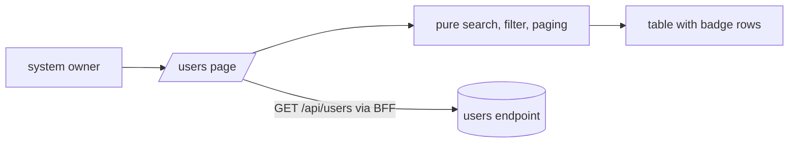

# Spec: Users Table

Status: implemented (PR #40).

Seam: this is a web only feature. The page reads the existing users
endpoint through the BFF. Pure choice functions own search, filter,
and pagination. The table renders from registry components. The API
stays untouched.

## Problem Statement

Registration can be open, but the owner cannot see who signed up.
The user list lives in the database only. There is no page, no
search, and no filter. The owner cannot answer simple questions.
How many accounts exist. Who is active. Who registered last week.

## Solution

A new owner only page lists registered users. Each row shows the
email, a status badge, and the registration date. A search field
narrows the list by email. A dropdown filters by status. A second
dropdown picks the page size. Pager buttons move between pages. The
page loads all users once and does search, filter, and paging in the
browser. The data comes from the existing users list endpoint. There
is no second source of truth.

## User Stories

1. As a system owner, I want a users page in the app, so that I can see who registered.
2. As a system owner, I want each row to show the email, so that I can identify accounts.
3. As a system owner, I want a status badge per user, so that I can tell active and inactive accounts apart.
4. As a system owner, I want the registration date per user, so that I can see when accounts appeared.
5. As a system owner, I want to search by email, so that I can find one account fast.
6. As a system owner, I want the search to ignore letter case, so that I do not need to guess the exact form.
7. As a system owner, I want to filter the list by status, so that I can focus on active or inactive accounts.
8. As a system owner, I want pagination, so that the page stays easy to read with many users.
9. As a system owner, I want to pick the page size, so that I control how many rows I see.
10. As a system owner, I want a match count, so that I know how much the filters removed.
11. As a system owner, I want an empty state, so that I know no user matches my filters.
12. As a system owner, I want a loading state, so that I know the list is on its way.
13. As a system owner, I want a clear error state, so that I know when the list failed to load.
14. As a system owner, I want to retry after a load failure, so that I do not reload the page.
15. As a system owner, I want the page entry in the owner only nav section, so that regular users never see it.
16. As a non owner, I want /users to send me to the dashboard, so that I do not stare at a forbidden page.
17. As a visitor with no session, I want /users to send me to login, so that private pages stay shut.
18. As a system owner, I want the list to come from the existing users list endpoint, so that no second truth appears.

## Implementation Decisions

- The API stays untouched. The existing users list endpoint answers a
  flat list. The web does search, filter, and paging in the browser.
  User counts are small today. Server paging arrives when the invite
  spec scopes the endpoint.
- The page guards like the settings page. It reads the account, checks
  the system owner role, and redirects non owners to the dashboard.
  No session goes to login. The endpoint keeps its tenant admin guard.
  The two guards coincide for the seed owner today. The invite spec
  owns any alignment.
- The nav gains a users entry in the owner only system section. The
  nav icon union gains one users value, and the shell render gains
  the matching icon branch. The nav builder already hides that
  section from non owners.
- The table, select, and badge components come from the shadcn
  registry in the base-nova style. The ui barrel gains their exports.
  App code imports them from the barrel. This spec adds no component
  without a caller.
- A lib module owns the data flow. It loads the list through the BFF,
  reduces load states, and exposes pure helpers for search, filter,
  and paging. The endpoint result is the only source of list state.
- Search is a case insensitive substring match on email. Status
  filter passes all, active, or inactive. Paging slices the filtered
  list. Page sizes are 10, 25, and 50. The default is 10. Any change
  to search, filter, or page size resets the page to one. The pager
  clamps to the last page. Helpers stay pure so tests need no render.
- Dates render as date only ISO, format YYYY-MM-DD. One format keeps
  tests and screens in agreement.
- The state copy is pinned. Loading shows the house ellipsis form.
  Failure shows err plus the message and a retry button. An empty
  result shows no users match. The count line shows filtered of total
  users and renders only when the list is ready. The copy strings
  live as exported constants so tests and screens stay in agreement.
- The page stays under the line cap. A thin server page owns the
  guard. A client component owns the table and its controls, in the
  split the settings page uses. The lib keeps logic out of both.

## Testing Decisions

- Web tests pin the pure helpers. Search matches case insensitive,
  filter splits by status, paging slices and bounds correctly with
  sizes 10, 25, and 50. Prior art is the system settings lib tests.
- Web tests pin the wiring with stubbed fetch. The loader calls the
  BFF users path, maps the body, and maps failures to an error state.
- Web tests pin the pinned copy. Loading, error, empty, and count
  strings stay exact so screens stay in agreement.
- No render tests. The repo has no render harness. This matches the
  known gap noted by earlier specs.
- The API gains no tests because it gains no code.

## Out of Scope

- Server side pagination, search, and filter query params.
- Row actions such as delete, deactivate, or edit.
- Role and display name columns. They need new API reads.
- Scoping the users endpoint per tenant. The invite spec owns that.
- Sorting controls and column sorts.
- Export to CSV.
- Aligning the endpoint guard with the page guard.

## Further Notes

- The visual lives beside this file in spec.html. It shows the page
  shape and the test seam.
- Cross spec pact holds. The invite spec will scope the users
  endpoint per tenant and may add server paging. This page reads the
  endpoint as it is today and needs no change when that lands.
