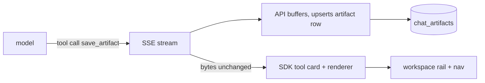

# Chat artifacts

## Problem Statement

Assistant answers live only inside message bubbles. A report, table, or
document the assistant produces cannot be opened on its own, listed, or
revisited once the thread scrolls on. The OpenUI SDK has a full artifact
system (workspace rail, artifact browser, side panel) that taipan does not
use.

## Solution

The assistant gains a `save_artifact` tool. When it calls the tool, the API
persists the content as a versioned, tenant- and user-scoped artifact row.
The web registers an artifact renderer and storage, so the SDK shows the
workspace rail, the sidebar artifact nav, and the side panel. Documents
render as markdown; tables render as SDK tables.

## User Stories

1. As an authenticated member, I want the assistant to save a long answer as
   a document, so that I can open it later on its own.
2. As an authenticated member, I want an artifact list in the sidebar, so
   that I can find past deliverables.
3. As an authenticated member, I want the workspace rail to open a saved
   artifact next to the chat, so that I keep the conversation context.
4. As an authenticated member, I want artifacts scoped to me, so that other
   users never see mine.
5. As an operator, I want artifacts versioned on update, so that history of
   changes is traceable.

## Implementation Decisions

### Creation path: a save tool

The SDK registers artifacts only from tool calls, and taipan's gateway is a
plain OpenAI-compatible relay. So:

- The completion request gains `tools: [save_artifact]` with
  `tool_choice: "auto"`. The tool schema: `{title, type, content}` where
  `type` is `taipan_document` (markdown string) or `taipan_table` (JSON
  rows).
- `Gateway.stream` gains an optional `tools` parameter alongside messages.
- `complete.py` already buffers the whole stream. It now also accumulates
  `delta.tool_calls` fragments, upserts one artifact row per call at stream
  close, and relays the SSE bytes unchanged so the SDK renders its own tool
  timeline card.
- The API never fabricates a tool result message, so the live-thread parser
  sees `args` only. The renderer parser builds everything from `args`
  (partial JSON mid-stream; the SDK ships `partialJSONParse` for this).
- History persistence stays text-only today: after a reload the in-thread
  tool card does not replay. The artifact itself remains reachable from the
  sidebar nav and workspace because those read server storage. Accepting
  the reload loss keeps the storage contract untouched; persisting
  tool_calls is a follow-up if it bothers in practice.
- A model that never calls the tool changes nothing today; the parameter is
  inert overhead.

### Storage

One migration adds `chat_artifacts` (extension table):

- `id` UUID pk, `user_id` FK users cascade, `tenant_id` text, `thread_id`
  FK chat threads cascade, `type` text, `title` text, `content` JSONB,
  `version` int, created and updated timestamps.
- Indexes: `(user_id, type, updated_at)` for keyset listing, title search
  for the `name` filter.
- Update bumps `version`. Delete is ours only (the SDK interface has none).

The stored `content` is pinned to the response shape the browser storage
path feeds the parser: `{"markdown": str}` for documents, `{"rows": [...]}`
for tables. The one parser normalizes both this shape and the tool-call
`args` shape (`{title, type, content}`).

### API endpoints

| Operation | Method and path            | Notes                                   |
| --------- | -------------------------- | --------------------------------------- |
| List      | `GET /api/artifacts`       | `name`, `type` (repeatable), `after`, `limit` |
| Read      | `GET /api/artifacts/{id}`  | summary plus content                    |
| Update    | `PATCH /api/artifacts/{id}`| content only, bumps version             |
| Delete    | `DELETE /api/artifacts/{id}`| owner scoped                           |

All endpoints scope by `principal.user_id` and stamp `tenant_id`, same as
threads. The SDK contract maps: list returns `{artifacts, nextCursor}`,
get returns the full artifact, update takes `{id, content}`.

### Web

- BFF catch-all `/api/artifacts/[[...path]]` relay, same as threads.
- `chat-config.ts` gains a hand-written `artifactStorage` object (the SDK
  `restStorage` covers only threads) and passes a composed storage object.
- `defineArtifactCategories` registers `taipan_document` (markdown
  preview and full view) and `taipan_table` (SDK `Table`). The renderer
  `toolName` is `save_artifact`, so the SDK timeline card, auto-open, and
  workspace entry work without extra glue.
- Sidebar gains `<AgentInterface.ArtifactNav />`; `labels.artifacts` reads
  "Documents". Auto-open stays on (at most one new version per stream).

## Testing Decisions

- API HTTP tests: list paging and filters, owner isolation, version bump on
  update, cascade delete with thread, tool-call accumulation from a canned
  SSE fixture, artifact upsert at stream close, SSE byte pass-through with
  tool deltas present.
- BFF tests: relay and cookie forwarding.
- Web Vitest: `artifactStorage` request shapes against a stubbed fetch;
  renderer parser mapping for both types.

## Out of Scope

- Editing artifacts from the workspace (SDK `EditableTable` path is a
  follow-up).
- Artifacts surviving thread deletion (cascade is intentional).
- Tenant-wide or shared artifacts.
- Encrypting artifact content (chat messages are plaintext JSONB today;
  a repo-wide field-encryption pass covers both later).

## Open Questions

1. Do we need artifact delete in the UI, or API-only for now?
2. Should `thread_id` become nullable so artifacts outlive threads?
