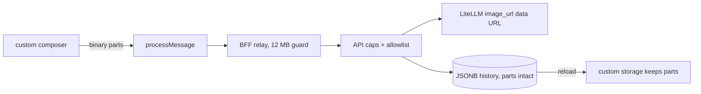

# Chat composer attachments

## Problem Statement

The chat composer accepts text only. Users cannot paste or attach an image
to ask about it. The SDK renders attachment parts in sent messages and
converts `binary` parts to OpenAI `image_url` data URLs on the wire, but it
has no attachment UI and its storage round-trip drops non-text parts.

## Solution

Phase 1 only: images as data URLs. A custom composer slot adds a file
picker with draft previews. Sent images travel as `binary` parts, render in
the thread, reach LiteLLM as `image_url` parts, and survive reloads after a
storage round-trip fix. Size caps and a mime allowlist are enforced end to
end. Arbitrary files are a separate later spec.

## User Stories

1. As an authenticated member, I want to attach an image to my message, so
   that the assistant can see it.
2. As an authenticated member, I want thumbnails with remove buttons before
   I send, so that I can fix mistakes.
3. As an authenticated member, I want images still visible after a reload,
   so that history stays complete.
4. As an operator, I want size and count caps with a mime allowlist, so
   that one message cannot exhaust memory or storage.
5. As an operator, I want the caps enforced at BFF and API, so that a
   crafted client cannot bypass the UI.

## Implementation Decisions

### SDK facts (verified in the 0.17.0 dist)

- The built-in composer sends string content only. A custom composer is
  mandatory. `ComposerProps` gives `onSend(string)`, `onCancel`,
  `isRunning`, `isLoadingMessages`.
- `useThread().processMessage` accepts AG-UI messages whose content can be
  a parts array. `{type: "binary", mimeType, data, filename}` parts map to
  `{type: "image_url", image_url: {url: data:...}}` by
  `openAIMessageFormat`, which LiteLLM forwards as vision input.
- Rendering of sent image parts is built in. The gap is persistence:
  `fromApi` collapses non-text parts to empty text, so attachments vanish
  on reload unless we bypass it.

### Custom composer

- New component replaces the composer slot in `chat-app.tsx`. It keeps the
  SDK look (reuse the SDK composer classes) and adds: file input limited to
  `image/png|jpeg|webp|gif`, up to 5 images per message, about 1 MB each
  pre-encode, thumbnail drafts with remove.
- Text-only sends keep the plain string path. Sends with attachments call
  `processMessage` with a parts array. A spike confirms `processMessage`
  accepts array content before build-out.

### Persistence round-trip

- `chat-config.ts` wraps `restStorage` with a custom `ThreadStorage` that
  sends and loads user messages with parts intact (the backend JSONB already
  stores the full message dict verbatim).
- Verified loop: send with image, persist, reload, image renders, resend
  keeps the part.

### Caps and validation

- API: history validation excludes base64 payload from the 200k char text
  cap and adds separate caps instead: per-attachment count and bytes, total
  attachment bytes per request, and a total attachment bytes bound across
  the whole stored history, because history accumulates over runs.
- The API accepts `image_url` parts with data URLs only. `openAIMessageFormat`
  passes a client-supplied `url` through verbatim, so the scheme check and
  the mime allowlist run server side.
- `_derive_title` handles list content by extracting the first text part
  (today it crashes on part-shaped messages).
- BFF: explicit request body guard (reject above about 12 MB).
- API: request size middleware bound for the chat router.

### Composer slot ownership

This spec owns the custom composer slot. The queued-messages spec builds on
it. Queued messages are text only in v1: `ComposerProps.onSend` is typed
for strings, so attachment drafts do not participate in the queue until a
later spec extends the queue content model.

## Testing Decisions

- API tests: title derivation on parts, allowlist rejection, count and size
  caps, parts stored verbatim, text cap unaffected by base64.
- Web Vitest: composer draft state, parts-array message construction,
  storage wrapper round-trip with a parts message.
- One integration test covers send, persist, reload, resend with an image.

## Out of Scope

- Non-image files (documents, audio, video): needs an upload endpoint and
  reference storage; separate spec.
- Image generation.
- Attachments in shared threads beyond what the snapshot carries.

## Open Questions

1. Per-image cap: 1 MB pre-encode (proposed) or higher?
2. Total stored-history attachment bytes bound: 20 MB (proposed)?
