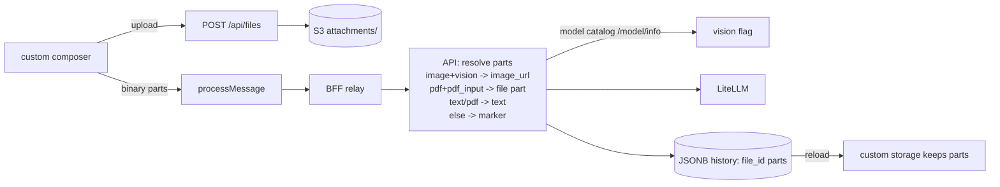

# Chat composer attachments

## Problem Statement

The chat composer accepts text only. Users cannot attach a file to ask
about it. Bytes must live in S3 behind the files registry: message
history carries file references, never base64 payloads. And not every
model sees images, so attachment handling must know which models take
vision input.

## Solution

The composer gains an attachment row. Drafts upload through
`POST /api/files` (purpose `attachment`) and render as thumbnails or
file chips from `/api/files/{id}/content`. A sent message stores
`binary` parts (file_id, filename, mime) next to its text part in
the JSONB history. At completion time the API resolves each reference:
images become `image_url` data URLs for vision-capable models, text and
PDF become extracted text parts, and anything a model cannot take
degrades to a text marker instead of breaking the thread.

## User Stories

1. As an authenticated member, I want to attach files to my message, so
   that the assistant can see them.
2. As an authenticated member, I want image thumbnails and file chips
   with remove buttons before I send, so that I can fix mistakes.
3. As an authenticated member, I want attachments still visible after a
   reload, so that history stays complete.
4. As an authenticated member, I want image attach disabled when my
   model has no vision, so that I am never offered a dead feature.
5. As an authenticated member, I want my thread to keep working when I
   switch to a non-vision model, so that one past image does not kill
   the conversation.
6. As an operator, I want count and byte caps enforced at API, so that
   a crafted client cannot exhaust memory or the upstream context.
7. As an operator, I want file bytes in S3 and only references in
   history, so that JSONB stays small and dedup is possible later.

## Implementation Decisions

### Files registry integration

- Drafts upload immediately on pick: `POST /api/files` with
  `purpose=attachment`, `scope=tenant` (same-tenant visibility so
  shared threads can render them). The multipart path, 10 MiB cap,
  mime allowlist (`image/*`, `application/pdf`, `text/plain`), and
  keyset listing already exist.
- Removing a draft calls `DELETE /api/files/{id}`. A sent message owns
  its file rows for the life of the thread: deleting the thread does
  not delete files (they remain in the user's file registry);
  `detach_user` purges them on account deletion.
- No base64 anywhere: history parts hold `file_id` only.

### Message part shape

The AG-UI `InputContent` schema already types a `binary` part, so the
message carries the SDK-native shape instead of an invented type:

```json
{"type": "binary", "mimeType": "image/png", "id": "<file uuid>", "filename": "note.png", "url": "/api/files/<id>/content"}
```

- `id` holds the files-registry row id; `url` is the session-proxied
  content route for display. No bytes travel in the part.
- Stored verbatim in `chat_threads.history` JSONB. The text the user
  typed stays a normal `text` part.
- Renderer maps `binary` parts to `` for
  `image/*` or a download chip (filename) for the rest.

### Custom composer

- New component replaces the composer slot in `chat-app.tsx`, reusing
  the SDK composer classes. File input accepts the policy allowlist;
  max 5 attachments per message; drafts show thumbnails/chips with
  remove while uploads are in flight.
- Sends with attachments call `processMessage` with a parts array
  (text part first, then `binary` parts). A spike confirms
  `processMessage` accepts array content before build-out.
- Attach state reads the selected model's `vision` flag (below):
  `image/*` picks are refused with an explanatory hint when the model
  has no vision; `text/plain` and `application/pdf` always attach
  since they fall back to text resolution.

### Model capability

- `GET /api/chat/models` entries gain `vision` and `pdf_input` booleans.
  The catalog extends `ModelCatalog` to fetch `/model/info` once per TTL
  window and read `model_info.supports_vision` /
  `model_info.supports_pdf_input` per `model_name` (verified live on the
  dev gateway: `True`/`False`/`null` values merge from LiteLLM's cost
  map). A model with no info entry gets `false` for both (fail closed
  for input, never for listing). The same payload also exposes
  `supports_audio_input`, `supports_function_calling`, and
  `supports_tool_choice`; the catalog keeps them for the artifacts
  tool gating and future mimes.
- Only `model_info.mode == "chat"` models are listed; image, embedding,
  and audio-transcription deployments cannot serve `/v1/chat/completions`
  anyway.
- The completion route asks the catalog for the resolved model's flags
  (request model or the configured default) before resolving parts.

### API-side resolution

- `chat.complete.prepare` gains the resolved model's flags and an
  object-store-backed resolver. Each `binary` part carrying an `id`
  becomes:
  - `image/*` + vision model: `{"type": "image_url", "image_url":
    {"url": "data:<mime>;base64,<bytes>"}}` fetched via `files.open` as
    the uploader.
  - `text/plain`: a text part
    `Attachment <filename>:\n```\n<content>\n````.
  - `application/pdf` + `pdf_input` model: an OpenAI `file` part
    `{"type": "file", "file": {"filename": ..., "file_data":
    "data:application/pdf;base64,..."}}` (verified supported by
    `supports_pdf_input` on gpt-4o and Gemini via the gateway).
  - `application/pdf` without `pdf_input`: the text part after `pypdf`
    extraction; a failed extract yields the marker below.
  - anything else, or `image/*` on a non-vision model: a text part
    `Attachment <filename> (<mime>, <size>) not sent to the model.`
- Resolution failures (missing file, store down) produce the marker,
  never a 500; the marker keeps history honest about what the model
  saw.
- Caps: at most 5 `binary` parts per user message, resolved binary
  bytes (images plus native PDFs) ≤ 20 MiB total per request since
  base64 inflates ~33% on the wire, resolved text bytes ≤ 200k chars
  counting toward the existing total.
  Violations are 422 `MessageCapError`, enforced regardless of client.
- `_derive_title` extracts the first text part from list content
  (today it crashes on part-shaped messages).

### Persistence round-trip

- `chat-config.ts` wraps `restStorage` with a custom `ThreadStorage`
  that sends and loads user messages with parts intact (the backend
  JSONB already stores the full message dict verbatim;
  `fromApi` collapses non-text parts today).
- Verified loop: send with attachment, persist, reload, attachment
  renders, resend keeps the part.

### Shared threads

- Public share snapshots resolve `binary` parts at snapshot build:
  images embed as data URLs inside the snapshot (bounded by the same
  per-message count), other files render as name chips. Public viewers
  hold no session, so no live `/api/files` link is emitted.

### Composer slot ownership

This spec owns the custom composer slot. Queued messages serialize the
parts array the composer builds: attachment drafts upload at pick
time, so a queued send already carries `binary` parts and needs no
upload machinery of its own.



## Testing Decisions

- API tests: capability flags from a stubbed `/model/info` payload,
  image resolves to data URL only under vision, PDF to a `file` part
  under `pdf_input` and to extracted text otherwise, degrade markers,
  count and resolved-byte caps, title derivation on parts, unknown
  model defaults all flags false, non-`chat` modes filtered out.
- HTTP tests: attach upload through the session flow, parts stored
  verbatim, shared-thread snapshot embeds image bytes.
- Web Vitest: composer draft state and remove, attach refusal on
  non-vision model, parts-array send shape, storage round-trip.
- One integration test: send with image under a vision model, reload,
  resend keeps the part.

## Out of Scope

- Video and audio uploads: the `attachment` allowlist is the contract.
- Editing or annotating attached files.
- At-rest encryption: owned by the repo-wide at-rest spec.
