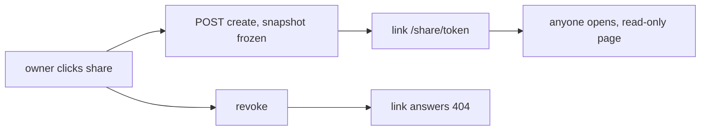

# Chat thread sharing

## Problem Statement

Chat threads are private to one user. A user who gets a good answer cannot
show the conversation to a teammate or stakeholder without a screen share.
The OpenUI SDK ships a share button and modal that need only a link maker.

## Solution

A share action in the thread header creates an immutable snapshot of the
thread. The snapshot lives behind an opaque token URL that works without a
session. The owner can revoke the link. Deleting the thread deletes its
shares.

## User Stories

1. As an authenticated member, I want a share button in the chat header, so
   that I can create a link to my thread.
2. As an authenticated member, I want the link to open a read-only
   transcript, so that viewers see the conversation without an account.
3. As an authenticated member, I want the shared view frozen at share time,
   so that later messages stay private.
4. As an authenticated member, I want to revoke a share link, so that I can
   undo an accidental share.
5. As an operator, I want share tokens stored hashed, so that a database
   leak does not expose live links.
6. As an operator, I want the shared page marked noindex, so that search
   engines never cache private conversations.

## Implementation Decisions

### Web (authenticated side)

- `AgentInterface` has no `generateShareLink` prop. The app renders the
  exported `ShareThread` component (its `generateShareLink` prop drives
  `ShareThreadModal`) inside `<AgentInterface.ThreadHeader>` children.
  `ShareThread` renders nothing on an empty thread.
- The function POSTs to the BFF and returns the absolute URL.
- `AgentInterface` has no read-only mode. The public page is our own
  server component.

### Share model

One migration adds `chat_thread_shares` (extension table, no columns on
existing core tables):

- `id` UUID pk, `token_hash` unique text (SHA-256 hex of the token),
  `thread_id` FK to chat threads with cascade delete and a unique
  constraint (one live share per thread), `tenant_id` text,
  `snapshot` JSONB (frozen OpenAI-shaped messages), `title` text,
  `created_by_user_id` FK to users, `created_at`, `expires_at` nullable,
  `revoked_at` nullable.
- Token: `secrets.token_urlsafe(32)` is not implementable here: only the
  hash is stored and create must keep the token while the row lives, so a
  random token cannot be re-served. Resolution: the token is
  `base64url(HMAC_SHA256(API_SHARE_TOKEN_SECRET, share_id))`; only the
  hash is stored. Revoke + recreate gets a fresh token via a new row id.
  The URL is `{public web origin}/share/{token}`. The token rides in the
  URL path; it can appear in access logs and browser history. Accepted
  risk for an authenticated-product share link.

### API endpoints

Paths follow the existing verb-suffixed threads convention:

| Operation      | Method and path                          | Auth     | Notes                          |
| -------------- | ---------------------------------------- | -------- | ------------------------------ |
| Create share   | `POST /api/threads/shares/create/{thread_id}` | session | owner check, refresh snapshot |
| Share status   | `GET /api/threads/shares/get/{thread_id}`  | session  | `{shared: bool}`; added so the revoke control works across sessions |
| Revoke share   | `DELETE /api/threads/shares/delete/{thread_id}` | session | sets `revoked_at`          |
| Read snapshot  | `GET /api/public/threads/{token}`        | none     | token is the credential        |

- `{thread_id}` in create and revoke is the thread id; the unique
  constraint makes the share idempotent per thread.
- Create refreshes the snapshot and keeps the token while the share row
  lives. After a revoke, a new create issues a fresh token.
- Read rejects revoked and expired shares with 404. It returns only title
  and messages. No tenant, user, or email data.
- Threads are user-scoped today; the owner check at creation is enough.
  `tenant_id` on the share row is an audit stamp.

### Web (public side)

- The existing authenticated catch-all relays create and revoke; only the
  cookie-free public read relay is new.
- Page `(public)/share/[token]`: server component fetches the snapshot and
  renders a read-only transcript with the existing assistant markdown
  renderer and the app theme. Dead token renders a 404. Response sets
  `X-Robots-Tag: noindex`.

## Testing Decisions

- API HTTP tests: owner isolation, snapshot freeze, revoke and expiry 404s,
  token hash storage, cascade delete with thread.
- BFF tests with injected fetch: cookie forwarding on create and revoke, no
  cookie requirement on the public read.
- Web: one Vitest test on `generateShareLink` error handling.
- Public page is server rendered; no DOM tests, matching the repo norm.

## Out of Scope

- Live shares that track new messages.
- Password-protected or tenant-wide shares.
- Expiry configuration UI (nullable column exists; no default expiry).
- Sharing attachments rendering beyond what the snapshot contains.

## Open Questions

1. Default expiry: none (proposed) or a fixed window?
2. Should the public page show the OpenUI chrome or a plain transcript
   (proposed: plain transcript in app theme)?
