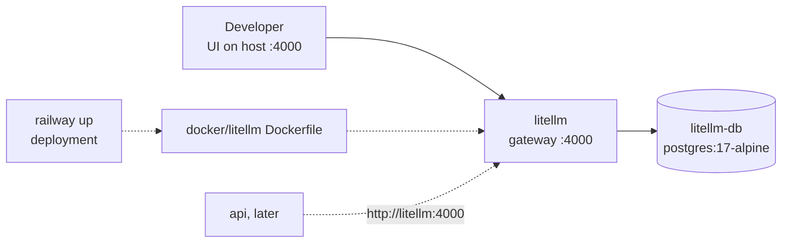

# Spec: LiteLLM gateway docker stack

Status: planned.

Seam: this spec adds infrastructure only. No Python or TypeScript
code changes, so no code seam moves. The test seam is the running
compose stack: both compose files must parse, the image must build,
and the gateway must answer HTTP the way LiteLLM answers.

## Problem Statement

Model traffic in this project will route through a LiteLLM proxy
gateway. Today no stack runs it. A developer cannot start one. A
deployer has no image to ship. The future API integration has no
stable address to point at. Each day of delay invites hardcoded
provider SDKs and keys.

## Solution

Run the LiteLLM proxy from the docker quickstart in both dev stacks,
with a pinned pull-through image for deployment. The shape mirrors
the Infisical services: a dedicated Postgres, committed dev-only key
defaults, a health-gated start, and one Dockerfile that is the single
source for the image tag. The gateway stores models and keys in its
own database. The Admin UI works from the host stack on port 4000.
No API code touches the gateway yet.

## User Stories

1. As a developer, I want a `litellm` service in the host compose stack, so that the gateway starts with one command.
2. As a developer, I want committed dev defaults for the gateway keys, so that the stack starts with no secret setup.
3. As a developer, I want to override the master key with an env var, so that I can run private tests against my own key.
4. As a developer, I want the gateway to store models and keys in its own database, so that state survives restarts.
5. As a developer, I want the gateway database to be a dedicated instance, so that its schema churn never touches the app database.
6. As a developer, I want a health check on the gateway database, so that the gateway starts only when its store is ready.
7. As a developer, I want the gateway pinned to one image tag in one file, so that dev, CI, and prod run the same build.
8. As a developer, I want the stack to start with no provider API keys, so that bring-up never blocks on external accounts.
9. As a devcontainer user, I want the same gateway services in the devcontainer stack, so that both dev paths behave the same.
10. As a devcontainer user, I want no new host ports in the devcontainer stack, so that both stacks can run at once without clashes.
11. As a devcontainer user, I want the gateway reachable at a stable in-network address, so that later wiring needs no config change.
12. As an admin, I want the Admin UI on the host stack at port 4000, so that I can manage models with a browser.
13. As an admin, I want the master key to also open the UI, so that I need no second credential.
14. As an admin, I want UI-added models saved in the database, so that they survive container replacement.
15. As an admin, I want the salt key to stay stable, so that stored provider credentials stay readable.
16. As an admin, I want an unauthenticated gateway request to fail with 401, so that the gateway never serves open traffic.
17. As a deployer, I want a pull-through Dockerfile under `docker/`, so that Railway deploys the gateway via `railway up` like api, web, and Infisical.
18. As a deployer, I want prod keys as environment variables, so that no secret lands in the repo.
19. As a deployer, I want the gateway to run its schema migration on first boot, so that a fresh database needs no manual step.
20. As a deployer, I want the gateway database on the repo-standard Postgres version, so that images stay uniform.
21. As a reviewer, I want the new Dockerfile to pass the existing docker gate, so that no new rule is needed.
22. As a reviewer, I want both compose files to validate with `docker compose config`, so that YAML errors never reach a run.
23. As a reviewer, I want the README and devcontainer docs to list the new service, so that onboarding docs stay true.
24. As a future API integrator, I want the gateway URL fixed in both stacks, so that the later integration is config, not surgery.

## Implementation Decisions

- Three artifacts change. One new file: a pull-through image file
  for the gateway, beside the Infisical one under the repo docker
  directory. Two edited files: the host compose file and the
  devcontainer compose file. Both stacks get the same two
  services, `litellm` and `litellm-db`. The repo convention that
  both stacks mirror each other decides this; shipping only the
  devcontainer half would break the parity that the Infisical
  blocks follow today. The host stack owns port 4000; the
  devcontainer stack publishes no port for it, exactly like
  Infisical on 8080.
- The image file is a pull-through pin:
  `FROM docker.litellm.ai/berriai/litellm:v1.104.0`. The tag is the
  single source of truth for the deployed version. In both compose
  files the gateway service builds from this file instead of naming
  an image. The registry and tag were verified to exist at spec
  time, and the tag matches the upstream release that upstream's
  own `main-stable` tag resolves to today. An upgrade is a one-line
  tag edit.
- The `litellm` service carries the quickstart environment:
  `LITELLM_MASTER_KEY` with a committed dev default of `sk-1234`
  (dev-only, same class as `POSTGRES_PASSWORD`; the real value comes
  from a Railway variable), `LITELLM_SALT_KEY` with a committed dev
  default (stable string; salt rotation has no in-place path and
  losing it makes stored provider credentials unreadable, the same
  warning class as the Infisical encryption key; the explicit
  default also beats upstream's fallback to the master key when the
  salt is unset), `DATABASE_URL`
  pointing at `litellm-db`, and `STORE_MODEL_IN_DB=True` so that
  UI-added models persist.
- The `litellm-db` service uses `postgres:17-alpine`, the repo
  standard, not the quickstart's Postgres 16. It gets a dedicated
  `litellm` user and database, a named volume per stack
  (`litellm-pgdata` on the host, `devcontainer-litellm-pgdata` in
  the devcontainer), a `pg_isready` health check, and no host port.
- Start order: `litellm` depends on `litellm-db` being healthy. The
  gateway itself gets no health check, matching the Infisical
  precedent; the upstream quickstart file omits one too. Nothing
  consumes it yet. The image applies its database schema on first
  boot, so a fresh volume needs no manual step.
- No config file. The quickstart's database mode needs no
  `litellm_config.yaml`; models live in the database. No Redis for
  the gateway in this phase; the quickstart has none.
- The existing docker gate scans new image files under the repo
  docker directory on its own. The pull-through file has no COPY
  lines, so the gate passes unchanged. The app build script stays
  untouched: it serves app images by contract, and docker directory
  images build through compose and `railway up`.
- Docs follow the repo rules, and three files hold the edit sites:
  the README (service list, compose command comment), the
  devcontainer guide (service inventory, shape diagram, and volume
  inventory, where the new volume makes its "all five volumes" line
  false), and the devcontainer README (service list and diagram).

## Testing Decisions

- A good test here asserts what the running stack does, never how
  the YAML is written. Nothing in the workspace test suites changes:
  no Python or TypeScript file is touched, so pytest and vitest
  stay green by construction.
- Validation crosses four seams, in order:
  1. Parse: `docker compose config` on both compose files exits
     clean.
  2. Gate: `scripts/check-docker.sh` passes with the new file.
  3. Build: `docker build -f docker/litellm/Dockerfile .` succeeds.
  4. Bring-up on the host stack: `litellm-db` turns healthy;
     `GET /health/liveliness` on port 4000 answers `I'm alive!`;
     the UI serves at `/ui`; `POST /chat/completions`
     without a key returns 401 and with the master key passes
     auth and fails only for lack of a model. No provider key is
     needed for any of this.
- Prior art: the Infisical bring-up pattern in both stacks, and the
  `pg_isready` health checks every database service already uses.

## Out of Scope

- API integration. No `API_*` env vars, no packages, no BFF routes,
  no app config fields, no client code.
- Model and provider setup. No `litellm_config.yaml`, no provider
  keys, no model list.
- Virtual keys, teams, budgets, and spend alerts.
- Redis, rate limits, caching, and Prometheus for the gateway.
- Railway dashboard wiring: service creation, database plugin, and
  domains stay manual, same as Infisical. The repo ships the
  Dockerfile only.
- CI: no new image build job.
- Production hardening: TLS, network policy, and backups for the
  gateway database.

## Further Notes

- Source: [LiteLLM docker quickstart](https://docs.litellm.ai/docs/proxy/docker_quick_start).
  Upstream quickstart shape: a `litellm` service plus a Postgres
  service, master and salt key env vars, `STORE_MODEL_IN_DB`, and a
  database health check. This spec keeps that shape and adjusts the
  details to repo conventions: Postgres 17, repo naming, committed
  dev defaults, dual stacks, and the pull-through pin.
- Upstream advises pinning a release tag for anything beyond local
  evaluation. `v1.104.0` was present on the registry at spec time.
- The master key doubles as the Admin UI password for the user
  `admin`. The UI lives at `/ui`.
- The pull-through pattern copies the Infisical image file, whose
  header comment is the repo's statement that Railway deploys such
  images via `railway up`, like api and web.
- The `/health/liveliness` spelling is upstream's. Do not correct it.
- Visual map: [spec.html](spec.html) beside this file.
