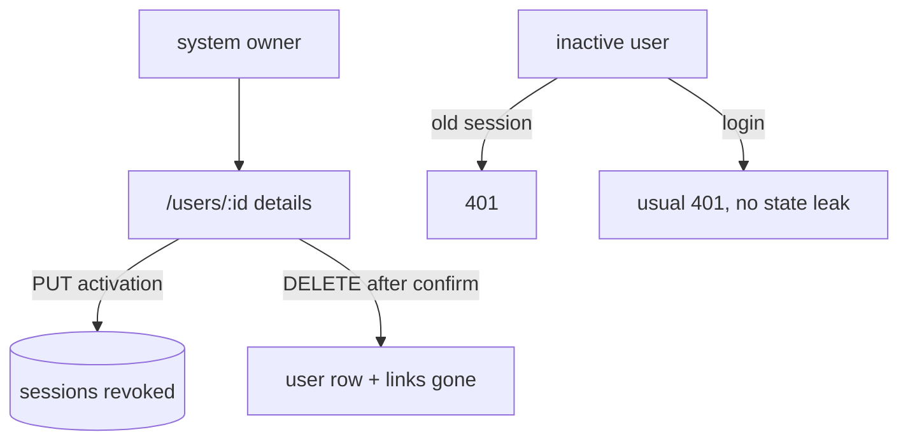

# Spec: Users Admin

Status: planned.

Seam: the users module owns account administration over the injected
session. Deactivation reuses the one revoke-all sessions seam. The
web reads and writes through the BFF. The endpoint result is the only
source of account state on either side.

## Problem Statement

The owner can see users, but cannot act. A troubled account stays
active. There is no way to switch an account off, no way to look
past the list row, and no way to remove an account. Worse, the
current state is soft: the users routes answer to any tenant admin,
a deactivated user would keep a live session, and profiles accept
writes from strangers.

## Solution

The owner opens a user's details from the list. Details show the
account fields, the profile, system roles, and tenant memberships.
From there the owner deactivates or reactivates the account, or
deletes it after a confirm step. Deactivation revokes the user's
live sessions and blocks login with the usual wrong-credentials
answer. Reactivation restores access. Deletion removes the account
and ends its sessions.

The users routes move to the system owner guard. Session resolution
rejects missing and inactive users. Profiles require a session and
serve writes to the owner of the profile only. An activation link
that outlives a deleted account answers the usual invalid link form
instead of crashing.

## User Stories

1. As a system owner, I want to open a user's full account details from the list, so that I can see who the account belongs to.
2. As a system owner, I want details to show the profile name, bio, and avatar, so that I can recognize the person.
3. As a system owner, I want details to show system roles, so that I know who holds owner rights.
4. As a system owner, I want details to show tenant memberships with their roles, so that I understand the account's reach.
5. As a system owner, I want details to show status and dates, so that I can see account age and state.
6. As a system owner, I want to deactivate an account, so that a troubled user loses access at once.
7. As a system owner, I want deactivation to end the user's live sessions, so that no stuck session outlives the decision.
8. As a system owner, I want to reactivate an account, so that a user can come back.
9. As a system owner, I want to delete an account, so that gone users leave the platform.
10. As a system owner, I want deletion to end the user's sessions too, so that no ghost session stays.
11. As a system owner, I want a confirm step before delete, so that a stray click cannot remove an account.
12. As a system owner, I want to be blocked from deactivating or deleting myself, so that I cannot lock myself out.
13. As a system owner, I want actions to repaint from the endpoint result, so that the screen never lies about account state.
14. As a system owner, I want each list row to link to the details, so that I get there in one click.
15. As a non owner, I want the details route to send me to the dashboard, so that account pages stay shut.
16. As a platform operator, I want the users routes owner-guarded, so that tenant admins cannot administer accounts.
17. As an inactive user, I want my old session to stop working, so that the off state is real.
18. As an inactive user, I want login to fail with the usual wrong-credentials answer, so that nobody learns the account state from the error.
19. As a platform operator, I want a stale activation or reset link for a deleted account to answer the invalid link form, so that the page does not crash.
20. As any user, I want my profile writable only by myself, so that strangers cannot edit it.
21. As the platform, I want the last active owner account irremovable, so that setup can never open again.

## Implementation Decisions

- The users routes move from the tenant admin guard to the system
  owner guard. Account administration is instance wide. No caller
  breaks today: the only admin is the seed owner, who holds the
  owner role too.
- Activation is one endpoint: PUT on the user's activation subpath
  with a JSON body carrying one active flag. It returns the updated
  user in the same shape as the list row. Unknown user answers 404.
  Targeting yourself answers 409 with the fixed reason: cannot
  change your own account.
- The service refuses to deactivate or delete the last active system
  owner. It answers 409 with the fixed reason: cannot remove the
  last active owner. The check runs inside the same transaction as
  the change.
- Deactivation revokes all of the user's sessions first. It reuses
  the same revoke-all seam that password reset and password change
  use. Reactivation touches sessions only by letting new logins in.
- Principal resolution rejects a missing or inactive user with 401
  on every route. Login already rejects inactive users before the
  hash check, so both paths give no account state away.
- The detail response extends the existing user response with the
  profile fields, system roles, and tenant memberships with their
  roles. The profile part is null when the user has no profile row.
  The shape is additive; the list keeps its current shape.
- Deletion keeps the existing cascade behaviour: profile, tenant
  links, tenant roles, system roles, and session rows go with the
  user. The service revokes sessions first. It answers 204.
- An activation or reset link whose user row is gone answers the
  same shape as an invalid or expired link. The two 500 paths
  disappear.
- Profiles require a signed-in session. A user reads and writes only
  the own profile. Another user's read answers 403, and an own read
  of a missing profile keeps its 404. The owner reads other profiles
  through the detail response, not through the profiles routes.
- Deletion leaves the user's personal tenant row and its tenant keys
  in place. They orphan quietly with no reader. A later cleanup or
  invite spec owns them. Email suppressions stay, because they are
  keyed by address and still protect the mail flow.
- The web gains a details route under the users path. It guards like
  the list page. A lib module owns the detail load, the activation
  set, and the delete, each as a small state machine fed only by
  endpoint results. A failed delete keeps the account on screen with
  the error. A confirmed delete sends the owner back to the list.
- On the details page the actions interlock: while one action is in
  flight the others sit disabled. An activation result merges into
  the loaded detail, so the status flips from the endpoint result
  while profile, roles, and memberships stay from the load.
- Delete asks for a second click on a pinned confirm label before it
  fires. The confirm resets when the target changes.
- Web copy lives in exported constants so tests pin the exact
  strings. Pure helpers stay out of the components.
- The users service owns activation and the owner checks. If the
  detail join pushes the module toward the line cap, the detail read
  splits into its own module next to it.
- There is no schema change in this spec. Every field and table it
  needs exists.

## Testing Decisions

- API tests cross HTTP with the real test database and the fake KV
  stores. Prior art: the users, gated users, and sessions test
  files, plus the revoke-all assertions in the sessions tests.
- Guard tests keep their status codes and gain one case: a tenant
  admin without the owner role gets 403 on every users route,
  including account creation. Owner callers keep 200. The profiles
  pin flips: anonymous profile access gets 401, another user's
  write gets 403, own read and write stay fine.
- Activation tests pin: the flag flips, sessions of the user die and
  others survive, a fresh login is refused with the same answer as
  unknown credentials, reactivation lets login back in, self target
  answers 409, and the last active owner answers 409.
- Session resolution tests pin: a session of a deactivated or
  deleted user answers 401.
- Detail tests pin the joined shape: profile fields, system roles,
  tenant memberships with roles, a null profile for a user without
  one, and 404 for an unknown id.
- Delete tests pin: revoke before removal, cascade removes profile
  and links, 204, and 409 on self.
- Activation link tests pin the invalid-link answer for a deleted
  user, in the exact response shape the registration and reset
  routers use.
- Profile guard tests pin: anonymous 401, another user's read 403,
  another user's write 403, own read and write fine.
- The tenant admin without the owner role needs a new seeding helper
  beside the existing setup owner helper in the test support.
- Web lib tests use stubbed fetch. They pin paths, mappings, failure
  mapping, and the state machines for load, activation, and delete.
  Copy pins stay exact. No render tests; the known repo gap stands.

## Out of Scope

- Editing another user's profile, even for the owner.
- Role management: granting or revoking the owner role.
- Invites and tenant-scoped user lists for tenant admins.
- Cleanup of personal tenants and tenant keys after deletion.
- Audit log and event publishing.
- Bulk actions and CSV export.
- Password reset flows for inactive accounts.
- Server side paging and filtering.

## Further Notes

- The visual lives beside this file in spec.html. It shows the
  action flows and the test seam.
- Cross spec pact holds. The revoke-all seam stays the one session
  killer. The endpoint result stays the only source of state on both
  sides. The invite spec still owns tenant-scoped lists; the guard
  split between owner routes and tenant routes resolves here for
  account administration.
